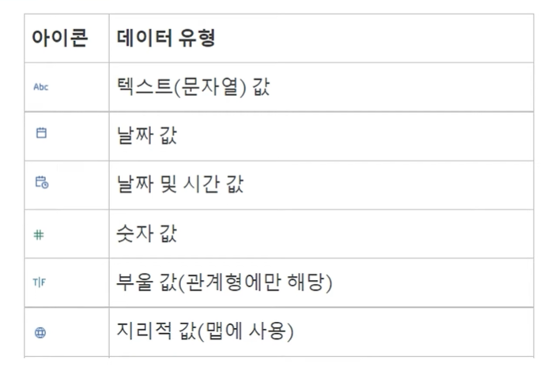
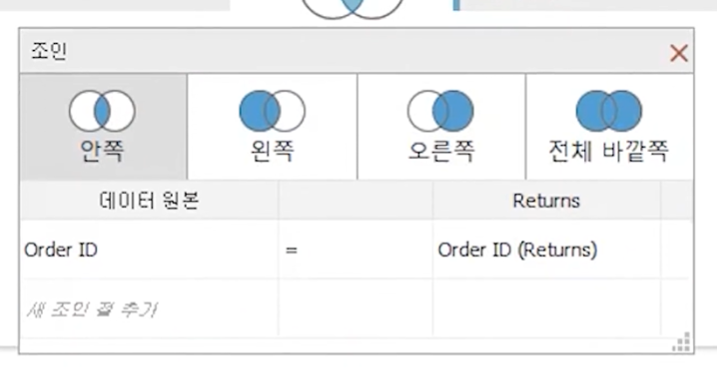
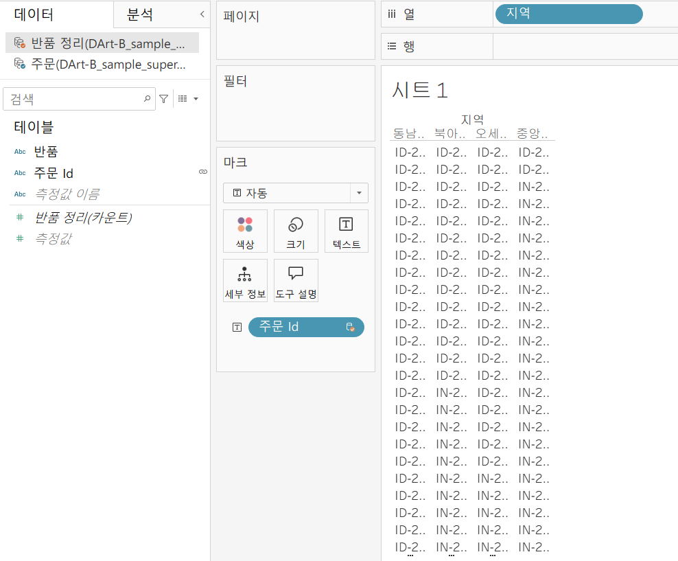
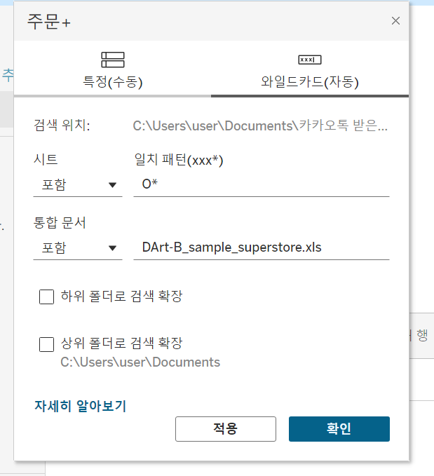
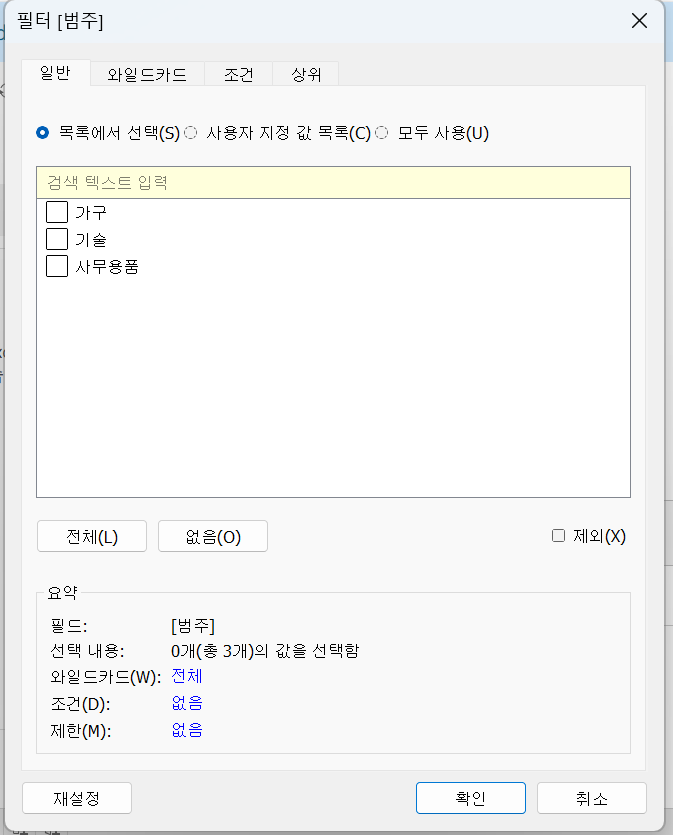
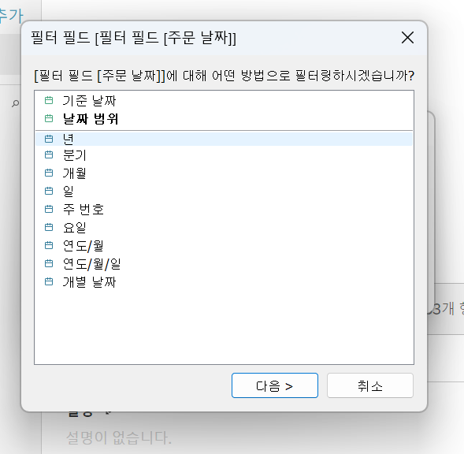

 First Study Week

- 1강: [태블로설치](#1강-태블로설치)

- 2강: [데이터연결](#2강-데이터연결)

- 3강: [데이터연결과 데이터유형](#3강-데이터연결과-데이터유형)

- 4강: [데이터결합과 관계](#4강-데이터결합과-관계)

- 5강 : [데이터결합과 조인](#5-데이터결합과-조인)

- 6강: [데이터결합 혼합](#6강-데이터결합-혼합)

- 7강: [데이터결합과 유니온](#7강-데이터-결합과-유니온)

- 8강: [라이브 및 추출](#8강-라이브-및-추출)

- 9강: [데이터형식](#9강-데이터형식)

- 문제1 : [문제1](#문제-1)

- 문제2 : [문제2](#문제-2)

- 참고자료 : [참고자료](#참고-자료)


## Study Schedule

| 강의 범위     | 강의 이수 여부 | 링크                                                                                                        |
|--------------|---------|-----------------------------------------------------------------------------------------------------------|
| 1~9강        |  ✅      | [링크](https://youtu.be/3ovkUe-TP1w?si=CRjj99Qm300unSWt)       |
| 10~19강      | 🍽️      | [링크](https://www.youtube.com/watch?v=AXkaUrJs-Ko&list=PL87tgIIryGsa5vdz6MsaOEF8PK-YqK3fz&index=75)       |
| 20~29강      | 🍽️      | [링크](https://www.youtube.com/watch?v=AXkaUrJs-Ko&list=PL87tgIIryGsa5vdz6MsaOEF8PK-YqK3fz&index=65)       |
| 30~39강      | 🍽️      | [링크](https://www.youtube.com/watch?v=e6J0Ljd6h44&list=PL87tgIIryGsa5vdz6MsaOEF8PK-YqK3fz&index=55)       |
| 40~49강      | 🍽️      | [링크](https://www.youtube.com/watch?v=AXkaUrJs-Ko&list=PL87tgIIryGsa5vdz6MsaOEF8PK-YqK3fz&index=45)       |
| 50~59강      | 🍽️      | [링크](https://www.youtube.com/watch?v=AXkaUrJs-Ko&list=PL87tgIIryGsa5vdz6MsaOEF8PK-YqK3fz&index=35)       |
| 60~69강      | 🍽️      | [링크](https://www.youtube.com/watch?v=AXkaUrJs-Ko&list=PL87tgIIryGsa5vdz6MsaOEF8PK-YqK3fz&index=25)       |
| 70~79강      | 🍽️      | [링크](https://www.youtube.com/watch?v=AXkaUrJs-Ko&list=PL87tgIIryGsa5vdz6MsaOEF8PK-YqK3fz&index=15)       |
| 80~89강      | 🍽️      | [링크](https://www.youtube.com/watch?v=AXkaUrJs-Ko&list=PL87tgIIryGsa5vdz6MsaOEF8PK-YqK3fz&index=5)        |


## 1강. 태블로설치


## 2강. 태블로연결

엑셀에서의 열 = tableau에서 필드 

> **🧞‍♀️ 데이터 해석기는 어떤 경우 사용하나요?**

데이터 해석기를 지원하는 커넥터에서 병합된 셀, 메모, 바닥글, 빈 셀 등을 감지하고 이를 무시하여 데이터 집합의 실제 필드와 값을 식별할 수 있게 하는 기능 
데이터 관리시 tableau 가 읽기 쉽도록 해야하나 그렇지 않은 경우 데이터 해석기 기능 활용 가능 


데이터 원본 페이지에서는 테이블간 관계, 조인, 유니온 등의 작업 가능 

데이터 연결 후 테이블간 전처리 후 하단의 새 워크시트 생성 아이콘을 클릭하여 워크시트에서 시각화 진행 

## 3강. 데이터연결과 데이터 유형


> **🧞‍♀️ 라이브와 추출의 차이가 무엇인가요? 어떤 경우 사용하나요?**

기본 설정 - 라이브

라이브 : Tableau가 데이터에 직접 연결하는 형태
데이터 원본에 변화가 생기면 시트에서 작업한 내용에 바로 영향을 미치게 됨 
데이터에 직접 연결하게 되는만큼 데이터 양이 많아지면 처리 속도 및 성능이 저하될 수 있음 

추출: 현재 데이터 원본의 상태를 hyper 형태로 저장하고 Tableau에서 이 추출 파일을 가지고 작업하게 됨 데이터 베이스 연결하지 못하는 오프라인 상태에서도 추출 파일을 가지고 있다면 작업이 가능하며 라이브에 비해 처리속도가 빠름 데이터 원본이 변경된 경우 새로 고침을 통해 추출 데이터 최신화 가능 

<데이터 유형>


데이터 유형 변경 : 데이터 원본 페이지에서 
필드명 변경 - 필드명 더블클릭 / 변경하고자 하는 필드명 우측의 아래 세모 아이콘 클릭하고 이름 바꾸기 선택 
필드 유형 변경 - 유형 아이콘 클릭 

## 4강. 데이터결합과 관계


A와 B 테이블이 C라는 공통 데이터를 가지고 있을 때 A테이블과 B테이블의 상관관계 분석 등을 위해 데이터 결합 필요 

관계로 결합된 데이터는 조인으로 결합된 데이터보다 동적이고 유연하게 연결됨 (원본 데이터를 좀 더 독립적으로 활용)
결합하려는 데이터 간 유형이 동일해야함
A와 B 사이의 C가 각각의 테이블에서 같은 필드 값을 가지고 있을때 
주문 - 반품 -> 주문 id 필드 기준으로 두 테이블 연결됨 
처음 끌어온 테이블이 루트 테이블이 됨 루트 테이블 삭제 시 관련된 하위 테이블 모두 삭제됨 
단일 테이블 병합 x 두 개의 테이블이 각각 독립적으로 활용될 수 있음 
조인에서 발생할 수 있는 데이터 중복 및 필터링 문제 방지하고 유연하게 데이터 결합할 수 있도록 함 
데이터를 결합할때 원래 테이블의 세부 수준을 유지할 수 있게 하기 때문에 Tableau에서는 데이터를 결합할때 관계로 결합하는 것을 권장 


## 5강. 데이터결합과 조인

조인이란?
제어 혹은 의도적인 필터링, 복제를 위해 조인으로 데이터를 결합하는 경우가 있음

<조인 방법>

1. 주문 테이블 캔버스로 끌어다놓기 
2. 필드에 있는 주문 테이블 더블 클릭하거나 마우스 오른쪽을 클릭해 열기 누르면 테이블을 열 수 있음 
3. 반품 테이블 캔버스로 끌어다놓기 

조인 아이콘 클릭하면 조인 유형 선택 가능



inner 조인 :  데이터 결합시 두 테이블 모두의 일치하는 항목만을 포함 테이블 간 데이터 일치하지 않으면 값 완전히 삭제됨 
left 조인 : 한쪽 테이블의 모든 값과 반대쪽 테이블에 해당하는 일치 항목만을 포함 왼쪽 테이블의 값이 오른쪽 테이블에 일치하는 값이 없을 경우 데이터가 null로 표시 
right 조인 : 한쪽 테이블의 모든 값과 반대쪽 테이블에 해당하는 일치 항목만을 포함
outer 조인 :  두 테이블의 모든 값을 완전히 포함하는 테이블 생성 한 테이블의 값이 다른 테이블에 일치하는 항목이 없는 경우에도 데이터가 null로 표시 


주문 중 '반품된' 주문만을 가지고 분석을 진행하려고 합니다.

> **🧞‍♀️ 해당 목적 달성을 위해서 Sample store 데이터셋의 어떤 시트를 조인(혹은 릴레이션)해야 할까요? 조인키는 무엇인지, (inner, outer, left, right) 조인 유형은 무엇일지 논의해주세요.**

데이터를 조인한 데이터 원본 창의 캡쳐를 첨부해주세요.
몇 개의 주문이 반품되었다고 표시되나요?

<!-- 캡쳐 이미지를 첨부해주세요 -->

## 6강. 데이터결합 혼합

관계나 조인과 달리 데이터 실제로 결합 x 
각 데이터 원본을 독립적으로 결과를 집계한 후에 한 시트에서 데이터를 시각화 할 수 있도록 하는 방법 실제 혼합된 데이터 원본은 없고 여러 데이터 원본에 혼합된 결과만을 화면에 나타내는 것

<혼합 방법 실습>

주문 테이블 끌어오기 -> 시트의 상단 메뉴 창에서 데이터 탭 클릭 -> 새 데이터 원본 -> 엑셀 파일 클릭해서 반품 테이블 끌어오기 -> 다시 시트로 이동 

주문 테이블의 지역과 반품 테이블의 주문 id 하나의 시트에서 시각화 하려면?

주문 테이블의 지역 필드 열로 끌어오기 -> 테이블 반품으로 바꿔서 주문 id 필드 마크 창의 텍스트로 드래그 앤 드롭 

-> 서로 다른 데이터 원본 한 시트에 표시 가능 



데이터 혼합은 하나 이상의 필드가 연결되어 있어야함 
관계로 데이터 원본을 결합할 수 있기 때문에 추천하는 방법 x 

## 7강. 데이터 결합과 유니온


관계, 조인, 혼합은 데이터의 열을 추가하는 결합 방법 

유니온이란?
한 테이블의 행을 다른 테이블에 추가하여 데이터를 결합하는 방법

> **🧞‍♀️ 유니온을 사용하기 위한 전제 조건은 무엇인가요?**
데이터를 유니온으로 결합하기 위해서는 데이터의 테이블 구조 동일해야 함 
-> 각 테이블의 필드 수가 같고, 관련 필드의 필드 이름과 데이터 유형이 일치해야 함 

<유니온 방법>

방법1 : 시트 테이블 밑에 새 유니온 더블 클릭 -> 유니온하고자 하는 테이블 끌어오기 
방법2: 테이블 하나를 시트로 끌고 유니온하고자 하는 테이블을 시트 테이블 바로 밑으로 드래그

같은 테이블 유니온 하면? 행 2배가 됨 
여러 테이블 한 번에 유니온 하면? 
-> 유니온 편집 -> 와일드카드 
-> 일치패턴 작성 
eg. 대문자 O를 포함하는 모든 테이블 유니온하고 싶으면 O* 입력
S로 끝나는 테이블 모두 유니온하고 싶으면 *S
* <- 모든 문자열 포함한다는 의미 가짐




## 8강. 라이브와 추출


> **🧞‍♀️ 라이브와 추출 방법의 차이가 무엇인가요? 어떤 경우에 추출을 사용하면 좋을까요?**

차이점 : 데이터의 실시간 업데이트 
라이브 연결은 데이터 원본의 변경사항이 Tableau로에 반영되어 실시간으로 정보가 업데이트됨 
원본 데이터가 변경될 때 데이터베이스의 기본 데이터 쿼리함
사전 처리를 위해 Tavleau server에 데이터가 복사되지 않으며 데이터 베이스에서 모든 과정이 처리되기 때문에 데이터 베이스의 성능에 따라 통합문서의 속도가 달라짐 

추출 연결은 로컬 데이터이든 온-프레미스 데이터든 관계없이 원본 데이터에서 업데이트를 수신하려면 추출을 매번 새로 고쳐주어야 함 
일정 시간마다 데이터가 새로 업데이트 되는 정적인 방법으로 작업 시에 모든 데이터가 데이터 원본에서 Tableau server로 복사됨 
데이터 원본이 바뀌어도 시각화에 영향을 미치지 않으며 추출을 새로 고쳐야 함 
집계에 최적화되고 시스템 메모리에 로드되어 시각화를 빠르게 호출하는 데이터의 스냅샷
대규모 데이터 세트, 필터, 계산 등이 포함된 보다 복잡한 시각화에서 라이브 연결보다 훨씬 빠른 경향이 있음 


**참고자료 : 온프레미스 데이터란?**

기업이나 조직이 자체적으로 보유한 물리적 서버나 데이터 센터 내에서 직접 관리하는 데이터로, 조직 내의 하나 이상 서버에서 통제됩니다. 본 서버들은 기업의 데이터센터나 물리적 위치에 설치되어 있으며, 네트워크를 통해 해당 데이터에 접근하고 관리할 수 있습니다.


## 9강. 데이터형식

필터 기능을 통해 데이터 쿼리 가능 

필드 데이터 유형이 다르면 필터 적용할 때도 구성 화면이 다르게 나타남 

e.g. 
제품 카테고리 필드의 데이터 형식 - 문자열 



주문 일자 필드의 데이터 형식 - 날짜 




## 문제 1.

용웅이는 아래 사진과 같이 2024년 3월부터 7월까지의 지하철 승하차 이용객 데이터를 가지고 있습니다. 월별로 데이터셋이 나누어진 상태며, 용웅이는 해당 데이터셋 5개 모두를 한 번에 시각화하려 합니다. 필드 값(컬럼)의 이름, 데이터 유형, 개수는 모두 같습니다.


 이때, '조인, 관계, 혼합, 유니온' 중 본 목적에 적합한 결합 방법은 무엇인가요? 하나씩 드래그하지 않고, 와일드카드를 이용해 모든 데이터를 빠르게 결합해보세요.

<!-- 텍스트 및 이미지로 문제 풀이 과정을 기술해주세요 -->


## 문제 2.

상원이는 태블로를 사용하여 회사의 매출 데이터를 시각화하려고 합니다. 태블로에서는 데이터를 연결하는 두 가지 방식인 **라이브 연결과 추출 연결**이 있습니다. 두 방식 중 어떤 것을 사용할지 고민 중입니다.

다음의 일상생활 사례를 바탕으로, 어떤 상황에서 라이브 연결이 적합하고, 어떤 상황에서 추출 연결이 더 적합한지 설명하세요.

1. 사례 1: 실시간 주식 시세 확인
주식 거래를 하고 있는 수금의왕 상원이는 주식 시세가 매 순간 변동하는 실시간 데이터를 필요로 합니다. 이 데이터를 기반으로 빠르게 결정을 내려야 합니다.


```
여기에 답을 적어주세요!
```


2. 사례 2: 상원이는 저번 주 제주도로 여행을 갔었어요. 비행 중에 예산 계획을 세우려 하는데, 인터넷 연결이 불안정할 것 같아요. 여행 전 미리 예산 데이터를 다운로드해서 오프라인에서도 사용할 수 있으면 좋겠습니다.

```
여기에 답을 적어주세요!
```

## 참고 자료

데이터 분석을 하다보면 지역별로 경향을 알아보고자 할 때가 많습니다.

태블로에서는 시/도, 시군구명을 칼럼으로 가지고 있고, 그걸 지리적 위치로 바꿔주면 지도에서 위치를 인식하는데요.
하지만 읍면동(행정동) 단위까지 인식하지는 못합니다.

그럼 어떻게 읍면동 단위까지 세분화하여 표기할 수 있을까요?

이때 방금 배운 데이터 릴레이션 혹은 조인을 사용합니다.
맵 그래프는 지금 배울 부분은 아니지만, 데이터 병합에 관련된 부분이기에 필요하신 분들을 위해 아래 링크를 걸어두겠습니다.


바로 읍면동의 경계를 가지고 있는 shp, geojson 등 공간파일을 원본데이터와 머지하는 것입니다.

링크: https://subinze.tistory.com/m/2
