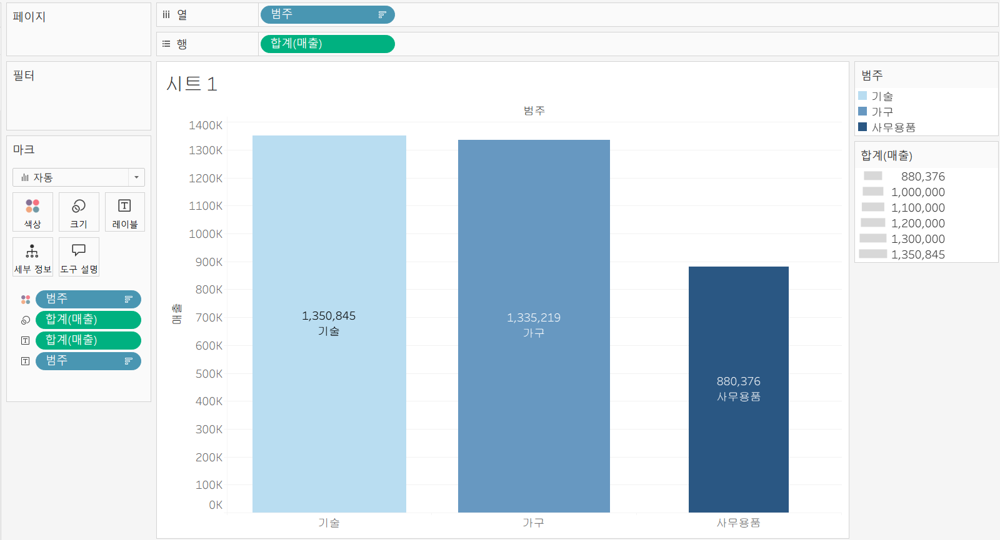
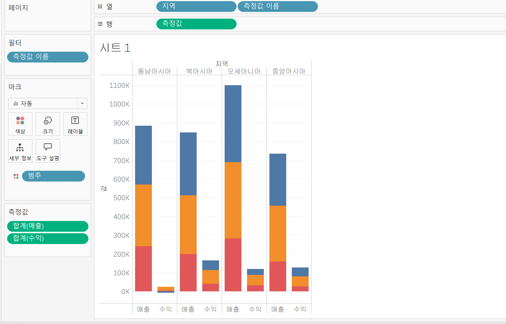
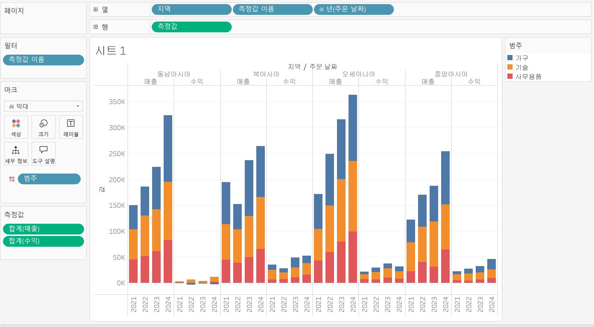
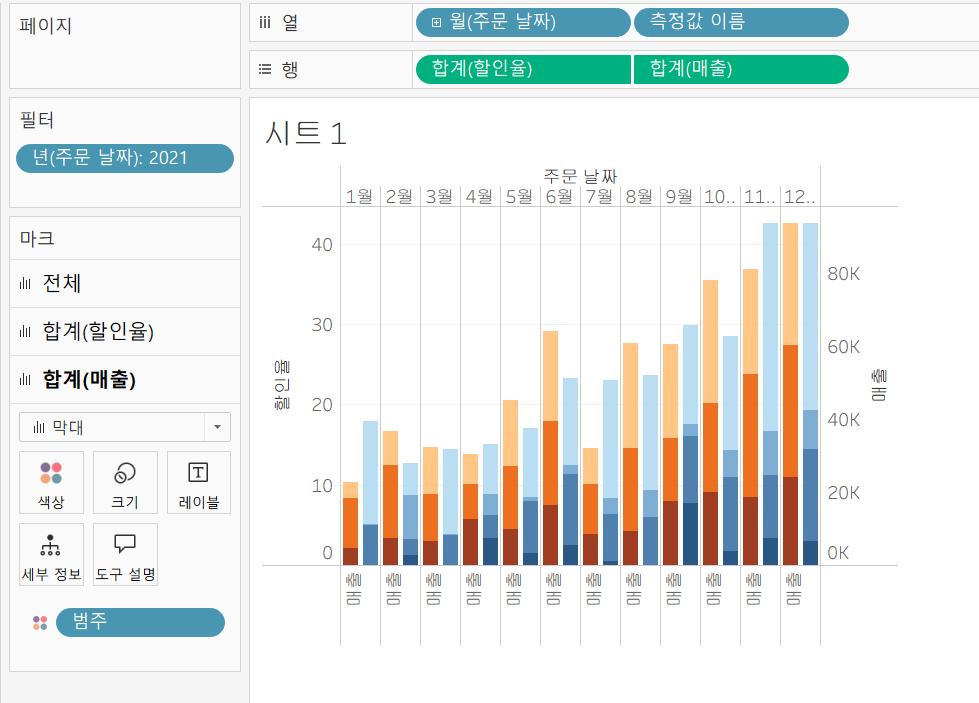
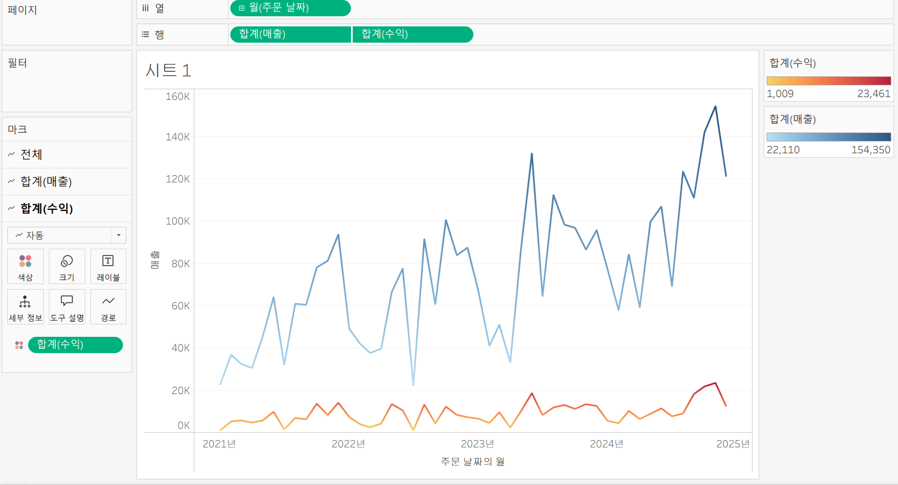
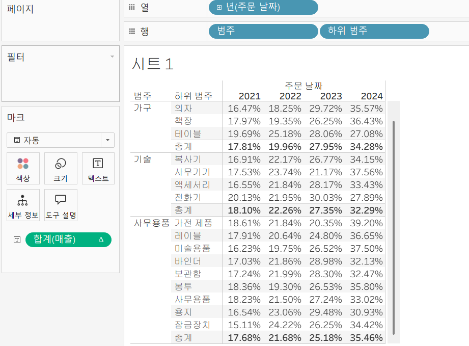
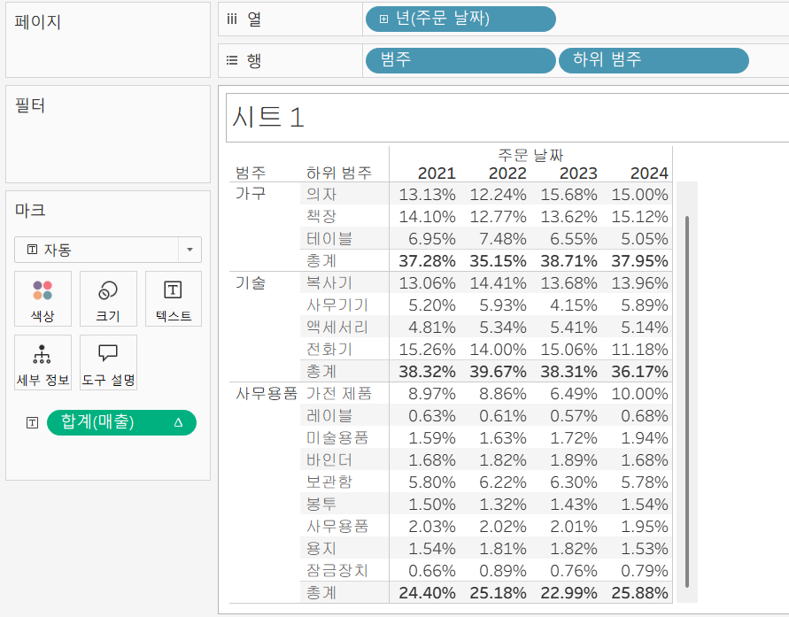
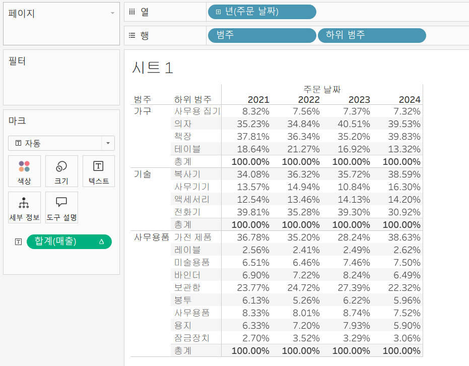
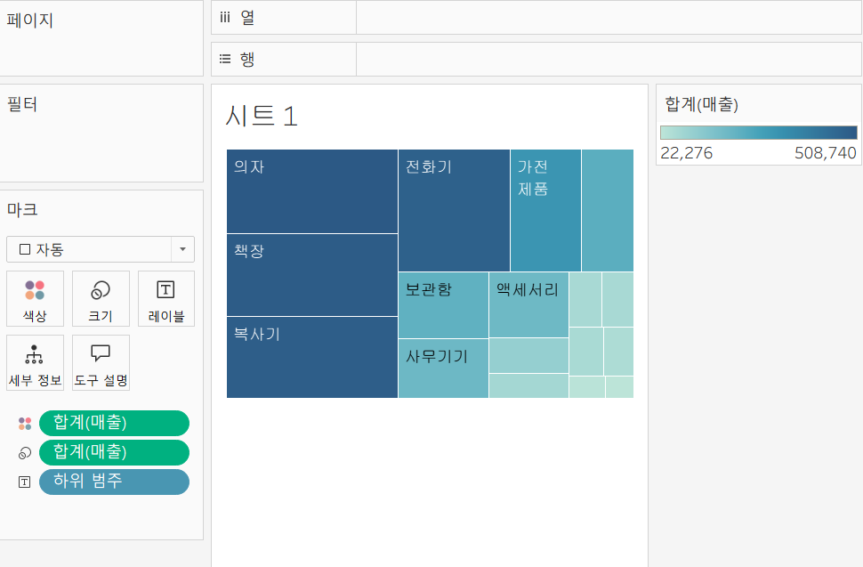
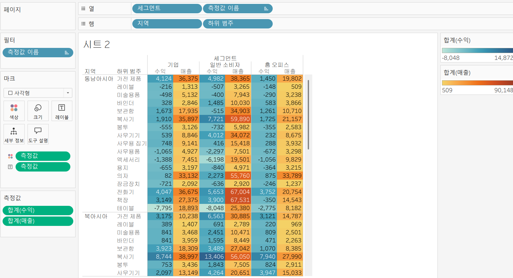

# Second Study Week

- 10강: [차원과 측정값](#10강-차원과-측정값)

- 11강: [시각화](#11강-시각화)

- 12강: [막대그래프](#12강-막대그래프)

- 13강: [누적막대그래프](#13강-누적막대그래프)

- 14강: [병렬막대그래프](#14강-병렬막대그래프)

- 15강: [누적병렬막대그래프](#15강-누적병렬막대그래프)

- 16강: [라인그래프](#16강-라인그래프)

- 17강: [맵작성](#17강-맵작성)

- 18강: [텍스트테이블](#18강-텍스트테이블)

- 19강: [트리맵과 하이라이트테이블](#19강-트리맵과-하이라이트테이블)

- 문제1 : [문제1](#문제1)

- 문제2 : [문제2](#문제2)

- 참고자료 : [참고자료](#참고-자료)


## Study Schedule

| 강의 범위     | 강의 이수 여부 | 링크                                                                                                        |
|--------------|---------|-----------------------------------------------------------------------------------------------------------|
| 1~9강        |  ✅      | [링크](https://youtu.be/3ovkUe-TP1w?si=CRjj99Qm300unSWt)       |
| 10~19강      | ✅      | [링크](https://www.youtube.com/watch?v=AXkaUrJs-Ko&list=PL87tgIIryGsa5vdz6MsaOEF8PK-YqK3fz&index=75)       |
| 20~29강      | 🍽️      | [링크](https://www.youtube.com/watch?v=AXkaUrJs-Ko&list=PL87tgIIryGsa5vdz6MsaOEF8PK-YqK3fz&index=65)       |
| 30~39강      | 🍽️      | [링크](https://www.youtube.com/watch?v=e6J0Ljd6h44&list=PL87tgIIryGsa5vdz6MsaOEF8PK-YqK3fz&index=55)       |
| 40~49강      | 🍽️      | [링크](https://www.youtube.com/watch?v=AXkaUrJs-Ko&list=PL87tgIIryGsa5vdz6MsaOEF8PK-YqK3fz&index=45)       |
| 50~59강      | 🍽️      | [링크](https://www.youtube.com/watch?v=AXkaUrJs-Ko&list=PL87tgIIryGsa5vdz6MsaOEF8PK-YqK3fz&index=35)       |
| 60~69강      | 🍽️      | [링크](https://www.youtube.com/watch?v=AXkaUrJs-Ko&list=PL87tgIIryGsa5vdz6MsaOEF8PK-YqK3fz&index=25)       |
| 70~79강      | 🍽️      | [링크](https://www.youtube.com/watch?v=AXkaUrJs-Ko&list=PL87tgIIryGsa5vdz6MsaOEF8PK-YqK3fz&index=15)       |
| 80~89강      | 🍽️      | [링크](https://www.youtube.com/watch?v=AXkaUrJs-Ko&list=PL87tgIIryGsa5vdz6MsaOEF8PK-YqK3fz&index=5)        |


<!-- 여기까진 그대로 둬 주세요-->
<!-- 이 안에 들어오는 텍스트는 주석입니다. -->

# Second Study Week

## 10강: 차원과 측정값

<!-- 차원과 측정값에 관해 배우게 된 점을 적어주세요 -->

> **🧞‍♀️ 차원과 측정값의 고유한 특성에 대해 설명해주세요.**

차원 - 정성적인 값을 가지고 있는 필드 
이름, 카테고리처럼 집계되거나 계산되지 않는 독립적인 필드

측정값 - 정량적인 값을 가지고 있는 필드 
매출, 수익, 수량 등 집계될 수 있는 값을 가짐 

기본적으로 차원은 불연속형(개별적으로 구별되는 값) 필드, 측정값은 연속형(단절이 없는 무한한 범위의 값) 필드
but, 반드시 성립 하는 것은 아님 차원도 연속형 필드가 될 수 있음 

차원과 측정값은 영역을 기준으로 중심이 구분됨 
불연속형과 연속형은 파란색/초록색으로 구분 

*Quiz: 차원은 불연속형이고, 측정값은 연속형이다 (o, x)*
X


## 11강: 시각화

<!-- 시각화 관해 배우게 된 점을 적어주세요 -->

e.g. 주문 날짜별로 매출 데이터 시각화
차원: 주문일자 / 매출: 측정값 
1. 주문날짜 더블 클릭 , 매출 필드 더블클릭 
-> 처음과 측정값에 따라 데이터를 자동으로 시각화해줌
2.  주문 날짜 필드 열 선반으로 드래그 앤 드롭, 매출 필드 행 선반으로 드래그 앤 드롭 
3. 뷰에 바로 필드 추가 : 주문 일자 필드 클릭한 채로 ctrl 누르고 매출 필드 선택 -> 시트로 필드 추가 -> 년도별 매출 나타남 
4. 마크 창 활용 : 주문 일자 열 선반, 매출 필드 마크 창 텍스트에 드래그 앤 드롭 

차원은 대부분 불연속형이며 표 형태로 시각화했을 때 머리글로 표시되고, 측정값은 대부분 연속형이므로 표 형태로 시각화 진행했을 때 패널로 추가됨 

머리글 추가하려면 (eg. 년도별로 지역별 매출 보기) 지역 필드를 년도 필드 옆으로 끌어오면 됨  

## 12강: 막대그래프

<!-- 막대그래프에 관해 배우게 된 점을 적어주세요 -->
막대그래프는 여러 범주의 데이터를 비교할 때 유용하게 활용

e.g. 카테고리별 매출 시각화 
1. 세로 막대그래프 
범주 필드 열 선반, 매출 필드 행 선반으로 드래그 

2. 매출 기준 정렬
(1)시트 위쪽의 빠른 메뉴 아이콘에서 내림차순 정렬 버튼 누르기
(2) 선반에 있는 범주 마우스 우클릭 or 오른쪽 작은 역삼각형 버튼 클릭 -> 정렬 -> 정렬 기준 '데이터 원본 순서'에서 '필드'로 바꾸기, 필드명은 '매출' 집계는 '합계', 정렬 순서 '내림차순' 선택 

3. 가로 막대 그래프
빠른 메뉴 -> 행렬 바꾸기 

4. 카테고리별 색상 바꾸기
범주 필드를 마크의 색상으로 드래그

Q. 매출 내림차순 정렬시 범례 순서 바뀌지 않았다면?
범례 순서 바꾸려면 범례 우클릭 -> 정렬 기준 '필드', 필드명 '매출', 집계 '합계', 정렬 순서 '내림차순' 선택 

Q. 그래프 색상 변경하고 싶으면? 
마크에서 색상 클릭 -> 색상 편집 -> 색상표 선택에서 원하는 색상 고르기

5. 막대그래프에 매출 숫자 표시하기
매출 필드 마크 탭의 레이블로 드래그 앤 드롭 
레이블을 막대그래프에 직접 표시하고 싶다면 레이블 클릭 -> 맞춤에서 세로 자동 -> 가운데 정렬

6. 매출 큰 순서대로 그래프 두께 조정 
매출 필드 마크 창의 크기로 드래그 앤 드롭 




## 13강: 누적막대그래프

<!-- 누적막대그래프에 관해 배우게 된 점을 적어주세요 -->

<!-- 테이블(아래로)와 테이블(옆으로)의 계산 방식을 습득해보세요. 이에 관련해 아래 참고자료도 있습니다 :) -->

누적막대그래프는 차원별로 측정값의 비중을 보여주기 위한 목적으로 사용 
축을 활용하여 구성비의 변화를 제공할 수 있음 

<카테고리 별 주문날짜 매출 누적 그래프>
1. 범주 필드 열 선반, 매출 필드 행 선반으로 드래그 
2. 주문날짜 필드 마크 탭 색상으로 드래그 앤 드롭 
3. 매출 필드, 년도 필드 레이블에 표시 
4. 년도 필드를 위에 표시하고 싶으면 레이블 클릭 -> 텍스트의 자세히 버튼 눌러서 수정 

<카테고리 별 년도 매출 백분율로 표현하기>
행 선반에 있는 매출 필드 우클릭 -> 퀵 테이블 계산 -> 구성 비율 -> ctrl 누른채로 마크 레이블 합계에 마우스 오버하면 레이블이 백분위 표시로 변경됨 
백분율이 전체 매출 대비 카테고리 년도 별 매출로 계산됨 
Why? 기본 설정이 테이블(옆으로)이기 때문 

Q 만약 카테고리별 년도의 매출 비율을 보고싶다면?
행 선반 매출 필드 우클릭 -> 다음을 사용하여 계산 -> 테이블(아래로) -> 레이블 복사 


## 14강: 병렬막대그래프

<!-- 병렬막대그래프에 관해 배우게 된 점을 적어주세요 -->

기본 막대그래프를 그룹화해서 나타내는 차트 
2021~2024년도까지의 월별 매출 병렬 그래프로 나타내기
1. 주문 날짜 열 선반, 매출 행 선반으로 드래그, 마크 창에서 자동-> 막대로 변경, 뷰 전체보기로 변경 
2. 월별 데이터를 보기 위해 열 선반에 있는 주문 날짜 + 버튼 두번 클릭, 년도와 분기 필드 ctrl 클릭한 채로 밖으로 날리기 
-> 모든 년도의 데이터가 월별로 합쳐지는 문제 발생 
Why? 주문 날짜 필드가 불연속형으로 되어 있기 때문
병렬 그래프를 그릴 때는 필드를 연속형으로 설정해야 각 막대의 수평 위치를 고정하여 그룹을 형성 


3. 주문 날짜 필드 연속형으로 변환

방법 1. 테이블 원본에서 바꾸는 방법
주문 날짜 필드 마우스 우클릭 -> 연속형으로 변환 
테이블에서 데이터 유형을 직접 변경하게 되면 표현하려는 뷰마다 데이터를 변경해야 하는 번거로움 존재, 다른 시트에서 해당 데이터 사용할때 데이터 유형 충돌 발생 가능성 있음 

방법 2. 선반에서 바꾸는 방법 
열 선반에 있는 주문 일자 필드 우클릭 -> 연속형에 있는 월 클릭

방법 3. 선반에 데이터 올려놓을 때 필드 이용 선택 
테이블에서 주문 날짜 가지고 올때 마우스 우클릭 한 채로 열 선반으로 끌고 오면 연속형 필드 선택할 수 있는 창이 뜸 

4. 년도별로 다른 색 표시하기 
열 선반에 있는 월 클릭한 채로 ctrl 누르고 색상으로 가져가기


> *🧞‍♀️ 끊어진 색상으로 배치되어 표현되는 경우와 이어지는 그라데이션 색으로 표현되는 경우 두 가지가 있습니다. 위 사진의 경우 왜 색깔이 끊어지는 색상으로 표시되지 않고 그라데이션으로 표시되었나요? 데이터의 특성과 관련하여 이야기해 봅시다.*

```
여기에 답을 적어주세요!
```

## 15강: 누적병렬막대그래프

<!-- 누적병렬막대그래프에 관해 배우게 된 점을 적어주세요 -->

<지역별 수익과 매출 데이터>
지역을 열 선반, 수익과 매출을 행 선반으로 끌어오기
표현 방식에서 누적 병렬 막대그래프 클릭
마크창에서 측정값 이름을 날리고 범주를 마크 창의 색상으로 드래그 앤 드롭하면 지역별로 수익과 매출 데이터를 카테고리로 누적해서 볼 수 있게 됨  



주문 날짜를 열 선반으로 끌고, 마크 창을 막대로 바꾸면 주문 날짜별로 데이터 볼 수 있음 



이중 축을 활용한 누적형 병렬 그래프

eg 2021년의 할인과 매출을 주문일자 월별로 그리기
할인은 지역에 따라, 매출은 상품 카테고리에 따라 누적 막대그래프 그리기 

1. 주문 날짜 필드 마우스 우클릭 후 필터 선반으로 드래그 앤 드롭 -> 년도 클릭 -> '2021'만 체크
2. 주문 날짜 필드 마우스 우클릭하며 열 선반에 끌어오기 -> '월' 클릭 
3. 측정값 이름 열 선반에 끌어오기
4. 할인, 매출 필드는 행 선반으로 드래그 앤 드롭
5. 이중축 만들기 
이중축이란? 두 가지 데이터를 하나의 축을 사용해 데이터 표현하는 방식 
행 선반 매출 마우스 우클릭 -> 이중축 -> 마크 창 막대로 변경 -> 전체 마크창에서 측정값 이름 날리기 -> 할인 마크창에서 지역 필드를 색상으로 드래그 앤 드롭 , 매출 마크창에서 범주 필드를 색상으로 드래그 앤 드롭 




> *🧞‍♀️ 위 사진에서는 Profit과 Sales를 측정값으로 두었습니다.  개별 칼럼(태블로에서는 #필드라 명칭합니다)을 열/행에 두는 대신, '측정값'을 사용하고 측정값 선반에 필드를 올려둡니다. 이런 방식을 사용하는 이유가 무엇일지, 어떻게 사용할 수 있을지 고민해보세요*

```
여기에 답을 적어주세요!
```

<!-- 정답은 없습니다 -->

## 16강: 라인그래프

<!-- 라인그래프에 관해 배우게 된 점을 적어주세요 -->

라인차트란?
데이터의 시간별 추세를 확인하거나 해당 데이터를 통해 미래 값을 예측하려는 경우에 사용 

<주문일자별 매출 확인>

열 선반에 주문 날짜 필드, 행 선반에 매출 필드 끌어오기 
-> 열에 날짜 필드가 있으면 자동으로 라인 그래프 나타남 

<월별 매출 데이터 확인>

열 선반의 주문 날짜 필드에서 '+' 눌러 '월'까지 만들고 '분기'는 날리기 

그래프가 이어지게 하고 싶다면?

열 선반의 '년' 필드는 날리고 '월' 필드 마우스 우클릭 -> 연속형 월로 변환 
불연속형 '월'의 경우 연도와 상관없이 월별 매출 합계가 집계됨

<매출과 수익의 비교>

수익 필드를 행 선반으로 가져오기 -> 열 선반의 수익 필드 우클릭 -> 이중축 -> 세로축 중 하나 우클릭 -> 축 동기화 (둘 중 범위가 큰 쪽으로 값이 같아짐)

<수익이나 매출이 클수록 색상 진하게 만들기>

테이블이나 선반에 있는 매출/수익 필드 마크 창의 색상으로 드래그 앤 드롭




## 17강: 맵작성

<!-- 맵차트 관해 배우게 된 점을 적어주세요 -->

```js
## 참고
Country/Region - 나라/지역
State/Province - 시/도
City - 시
County - 군
Postal Code - 우편번호
Area Code - 지역 코드
Airport - 공항
MSA/CBSA (Metropolitan Statistical Area) - 광역 통계 지역
Longitude - 경도
Latitude - 위도
```

## 18강: 텍스트테이블

텍스트 테이블: 일반적으로 보는 표 형식 

<연도별 제품 하위 범주 매출 확인>
1. 주문 날짜 필드 열 선반으로 드래그
2. 매출 필드 마크창의 텍스트에 드래그 앤 드롭
3. 제품 하위 범주 행 선반에 드래그 

<제품별 소계 및 총 합계 표시>
분석 탭에서 요약의 총계 클릭한 채로 시트에 올려놓고 소계에 드롭 
 
<연도별 하위 범주의 매출 구성 비율 표시>
1. 마크창의 매출 필드에서 마우스 우클릭 -> 퀵테이블 계산 -> 구성비율 -> 2021년에서 2024까지 총 하위 범주의 매출에서 해당 연도별로 매출 구성비율이 나타남 




2. 해당 연도의 매출에서 하위 범주별로 매출의 구성 비율 표시하려면 마크창의 매출 필드 마우스 우클릭 -> 계산 대상 -> 테이블(아래로)



3. 범주를 기준으로 구성비율을 보고싶으면 패널 (아래로) 선택 



구성비율의 소수점 조정 시 마크창 매출 우클릭 -> 서식 -> 숫자 -> 숫자 (사용자 지정) -> 소수점 설정 

## 19강: 트리맵과 하이라이트테이블

트리맵이란?
데이터를 중첩된 사각형으로 표시하며 색상과 크기를 측정값으로 표현 

<하위 범주로 트리맵 작성>
1. 하위 범주 마크 창 텍스트로 드래그  
2. 매출 필드 색상 & 크기로 드래그 
-> 매출이 높은 하위 범주가 크기는 크고 진한 색상의 사각형으로 표현됨 



<제품명으로 트리맵 작성>
제품 이름 필드를 마크 창의 하위 범주 위에 드래그 
제품명이 너무 많아서 매출이 높은 열개의 제품명만 표현하려고 함 
-> 매출을 기준으로 필터링 수행
1. 제품 이름 필드 필터에 드래그
2. 상위 탭 -> 필드 기준 클릭 -> 상위 10개 기준, 매출 필드, 합계 


하이라이트 테이블이란?
색상이 입혀진 특수 테이블
범주형 데이터를 색상으로 비교할 수 있기 때문에 텍스트 테이블에 여러가지의 다양한 데이터를 나타내야 할 때 사용

<지역 & 제품의 하위범주 & 고객 세그먼트별 수익과 매출 데이터 살펴보기>

1. 고객 세그먼트 필드 열 선반으로 드래그
2. 지역 & 하위 범주 필드 행 선반으로 드래그 
수익 & 매출 필드는 각각 더블클릭해서 레이블로 표현 
-> 텍스트 테이블 생성
3. 마크창에서 측정값 ctrl 누른채로 색상으로 드래그
4. 마크 자동-> 사각형으로 변경 
-> 하이라이트 테이블 생성 

수익과 매출을 한 번에 표현하고 있기 때문에 대부분의 매출은 높게, 수익은 낮게 측정되는 문제 발생

-> 수익과 매출을 각각 다른 색상으로 표현하기 

마크 창 색상 포함되어 있는 측정값 마우스 우클릭 -> 별도의 범례 사용 -> 범례 편집해서 원하는 색상으로 바꾸기 




> *🧞‍♀️하이라이트 테이블 등에서 두개 이상의 측정값을 사용하는 경우, 함께 색을 표현하게 되면 단위가 달라 정확한 값을 표현할 수 없습니다. 이때 클릭해야 하는 항목은?*

```
여기에 답을 적어주세요!
```


## 문제1

```js
지민이는 superstore의 한국 수출 관리 업무를 맡고 있습니다. 국가/지역이 우리나라, 즉 'South Korea'인 데이터만을 필터링하여, 상품 하위범주 별로 각 하위범주가 매출의 비율 중 얼마만큼을 차지하는지를 트리맵으로 확인하고 싶습니다. 트리맵의 각 네모 안에 표시되는 텍스트에는 **해당 범주의 이름과 전체에서 해당 범주가 차지하는 비율**이 표시되었으면 합니다.

지민이를 도와주세요! (풀이를 찾아가는 과정을 기술해주세요)
```

```
여기에 답을 적어주세요!
```

## 문제2

```js
주현이는 국가/지역별로 매출과 수익의 증감을 시간에 흐름에 따라 표현하고자 합니다. 특히 **한국/중국/일본**을 비교하고자 해당 3국을 남기고 필터링했고, 3개 국가를 매출과 수익이라는 두 가지 지표로 확인해보았습니다.

아래는 위 설명을 표현해본 예시입니다.
```


```js
레퍼런스와 꼭 같지 않아도 자유롭게 표현하고, 그 과정을 기술해주세요.
```

```
여기에 답을 적어주세요!
```

### 참고 자료

```js
테이블 계산에서 '다음을 사용하여 계산'에는 테이블 당 계산과 패널 당 계산이 있습니다. 이에 대해 이해하는 것이 꼭 필요하기 때문에, 외부 레퍼런스를 참고하여 이 단계에서 꼭! 학습 후, 넘어가주세요 :)
```


[참고 외부자료 링크는여기를클릭하십시다](https://velog.io/@eunsuh/Tableau-%EB%A0%88%EB%B2%A8UP-%EA%B0%95%EC%9D%98-%EC%A0%95%EB%A6%AC-1-%ED%85%8C%EC%9D%B4%EB%B8%94-%EA%B3%84%EC%82%B0)
