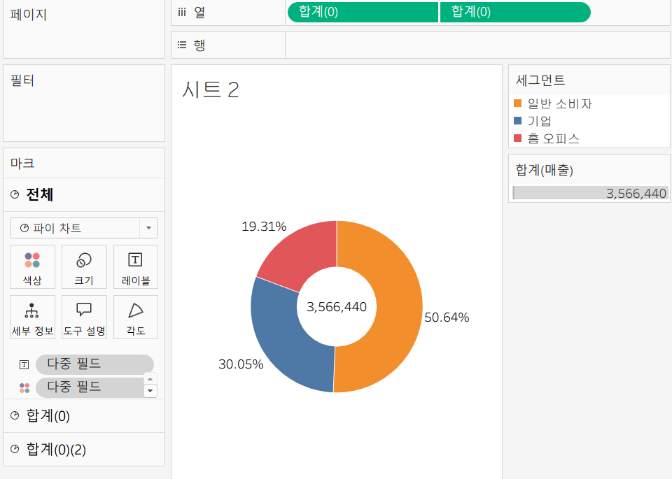
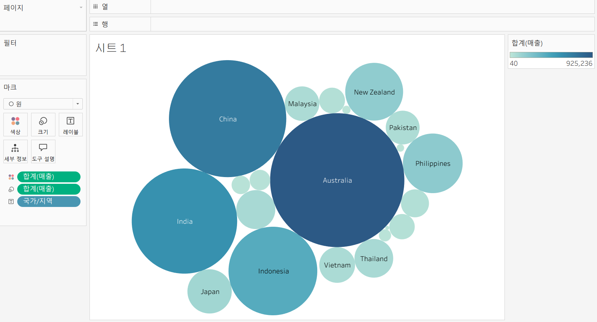
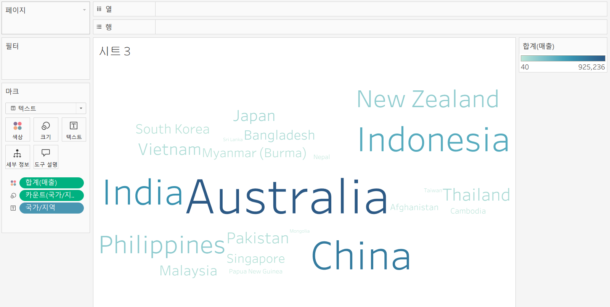
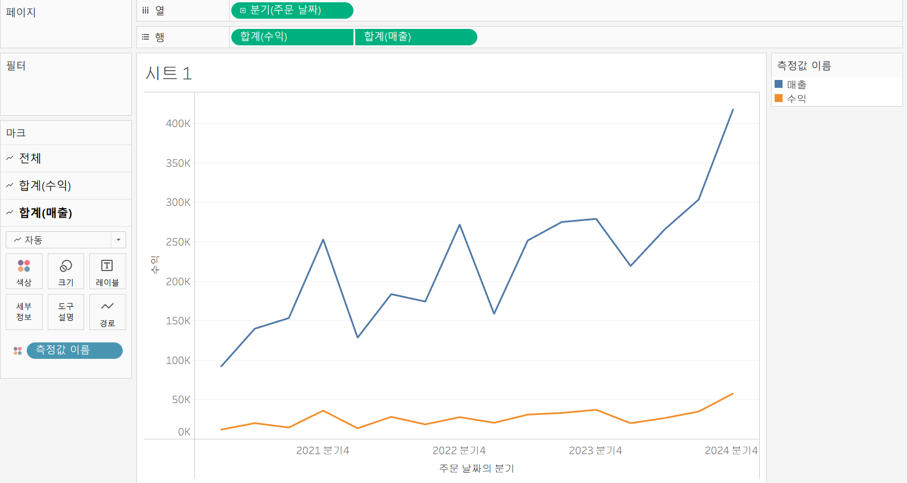
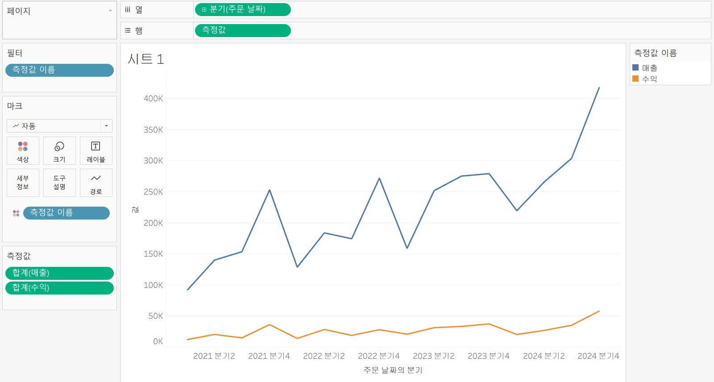
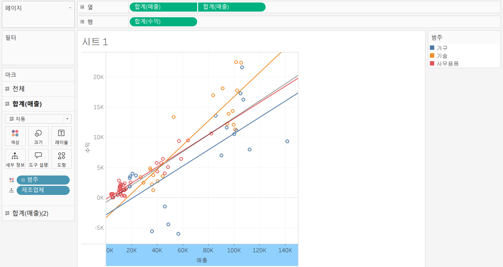
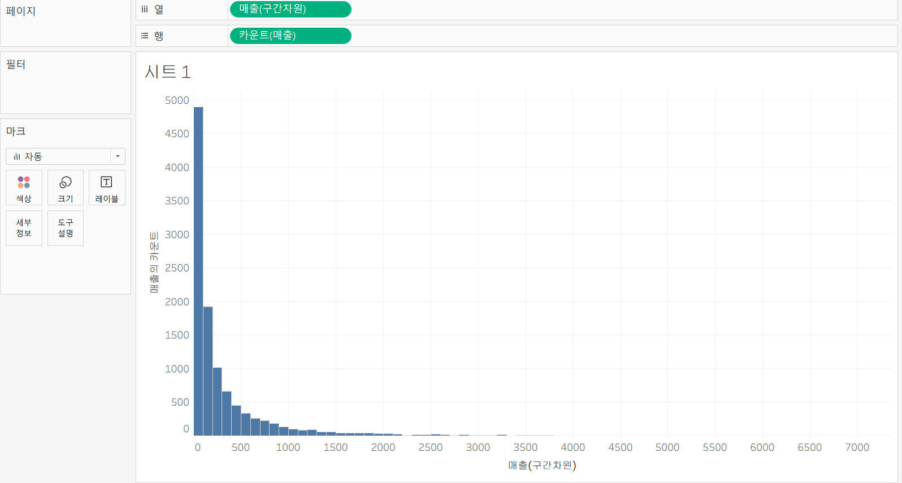
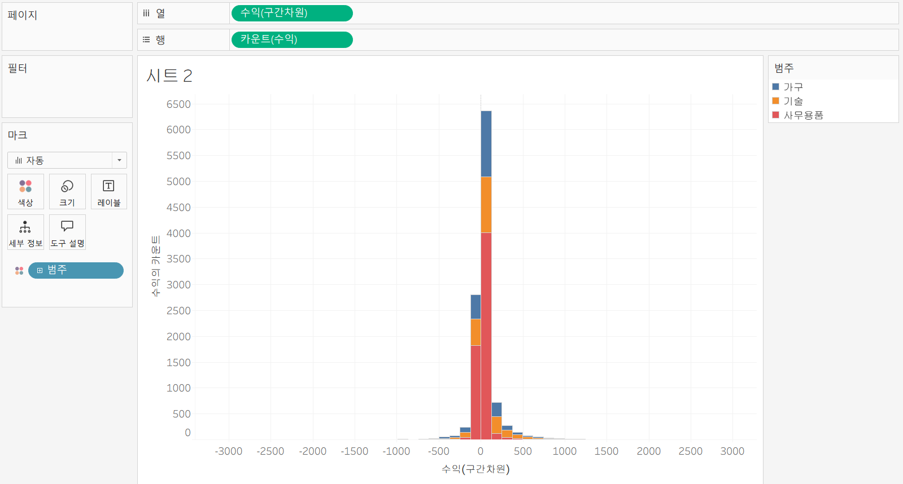
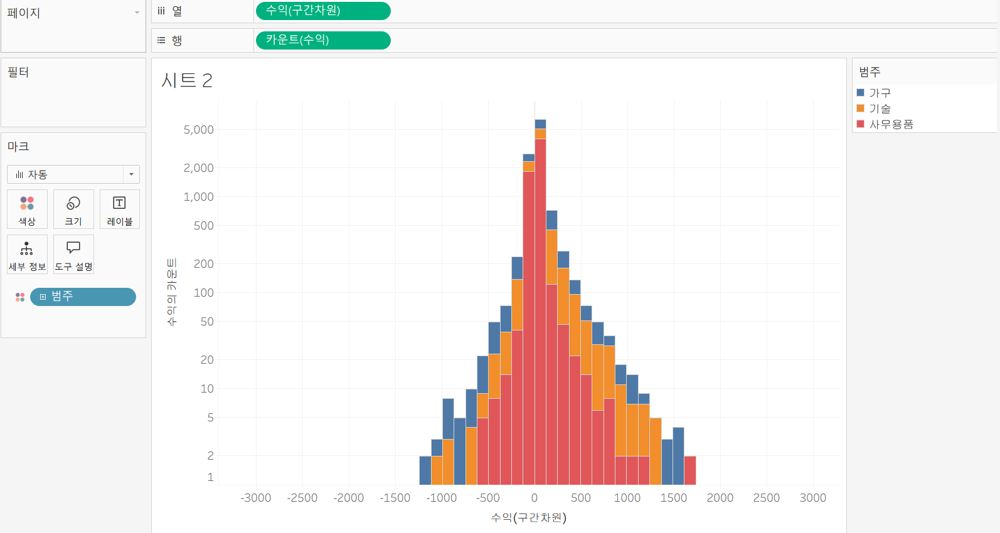

# Third Study Week

- 20강: [파이와 도넛차트](#20강-파이와-도넛차트)

- 21강: [워드와 버블차트](#21강-워드와-버블차트)

- 22강: [이중축과 결합축](#22강-이중축과-결합축)

- 23강: [분산형 차트](#23강-분산형-차트)

- 24강: [히스토그램](#24강-히스토그램)

- 25강: [박스플롯](#25강-박스플롯)

- 26강: [영역차트](#26강-영역차트)

- 27강: [간트차트](#27강-간트차트)

- 28강: [필터](#28강-필터)

- 29강: [그룹](#29강-그룹)


- 문제1 : [문제1](#문제1)

- 문제2 : [문제2](#문제2)

- 참고자료 : [참고자료](#참고-자료)


## Study Schedule

| 강의 범위     | 강의 이수 여부 | 링크                                                                                                        |
|--------------|---------|-----------------------------------------------------------------------------------------------------------|
| 1~9강        |  ✅      | [링크](https://youtu.be/3ovkUe-TP1w?si=CRjj99Qm300unSWt)       |
| 10~19강      | ✅      | [링크](https://www.youtube.com/watch?v=AXkaUrJs-Ko&list=PL87tgIIryGsa5vdz6MsaOEF8PK-YqK3fz&index=75)       |
| 20~29강      | ✅      | [링크](https://www.youtube.com/watch?v=Qcl4l6p-gHM)      |
| 30~39강      | 🍽️      | [링크](https://www.youtube.com/watch?v=e6J0Ljd6h44&list=PL87tgIIryGsa5vdz6MsaOEF8PK-YqK3fz&index=55)       |
| 40~49강      | 🍽️      | [링크](https://www.youtube.com/watch?v=AXkaUrJs-Ko&list=PL87tgIIryGsa5vdz6MsaOEF8PK-YqK3fz&index=45)       |
| 50~59강      | 🍽️      | [링크](https://www.youtube.com/watch?v=AXkaUrJs-Ko&list=PL87tgIIryGsa5vdz6MsaOEF8PK-YqK3fz&index=35)       |
| 60~69강      | 🍽️      | [링크](https://www.youtube.com/watch?v=AXkaUrJs-Ko&list=PL87tgIIryGsa5vdz6MsaOEF8PK-YqK3fz&index=25)       |
| 70~79강      | 🍽️      | [링크](https://www.youtube.com/watch?v=AXkaUrJs-Ko&list=PL87tgIIryGsa5vdz6MsaOEF8PK-YqK3fz&index=15)       |
| 80~89강      | 🍽️      | [링크](https://www.youtube.com/watch?v=AXkaUrJs-Ko&list=PL87tgIIryGsa5vdz6MsaOEF8PK-YqK3fz&index=5)        |


<!-- 여기까진 그대로 둬 주세요-->
<!-- 이 안에 들어오는 텍스트는 주석입니다. -->

# Third Study Week

## 20강: 파이와 도넛차트
<!-- 파이와 도넛차트에 관해 배우게 된 점을 적어주세요 -->
파이 차트는 전체에 대한 비율을 표시할 때 주로 사용

<제품 세그먼트에 대한 파이 차트 만들기>
1. 세그먼트 & 매출 필드 각각 더블클릭 
2. 우측 상단의 표현방식 파이 차트로 변경
3. 매출 필드 레이블에 가져와 수치 표현
4. 파이 차트 효과적으로 보기 위해 내림차순 정렬
5. 구성 비율로 표시하는법 : 레이블 필드 마우스 우클릭 -> 퀵 테이블 계산 -> 구성 비율 

> **🧞‍♀️ 도넛차트를 생성하는 법을 기록해주세요.**

<이중 축을 활용한 도넛차트 만들기>
전체 매출 표현하기 위해 도넛 차트 만들기 
파이 차트는 축을 따로 가지고 있지 않아 임의의 축 설정해주어야 함 

1. 열 선반에 빈 공간 더블 클릭 -> 0 입력 -> 임의의 축 생성 
2. 만든 필드 ctrl 누른채 옆으로 드래그 -> 두개의 원 생성 
3. 분리된 파이 차트 표현을 위해 두 번째 마크에 포함된 값들 빼내기 -> 레이블에 매출 필드 넣고 사이즈 조정 
4. 상단 선반의 두 번째 필드 우클릭 -> 이중축
-> 도넛 차트 완성! 

* 임의로 생긴 축 제거 방법 
1. 시트에서 우클릭 -> 서식 -> 격자무늬 클릭 -> 행 구분선 / 열 구분선 '모두 없음' -> 3선 아이콘 클릭 -> 영(0) 기준선 '없음'
2. 시트에서 축 선택, 마우스 우클릭 -> 머리글 표시 해제 




## 21강: 워드와 버블차트
<!-- 워드와 버블차트에 관해 배우게 된 점을 적어주세요 -->

버블차트란?
수치적 데이터를 원의 크기로 표현하는 차트

<국가별 매출에 따른 버블 차트 생성>

데이터 테이블에서 ctrl 누른채 국가/지역 & 매출 필드 클릭 -> 표현 방식에서 버블차트 클릭 
-> 매출 색상 마크에 넣어 색상 시각화 (매출 값이 높을수록 푸른색이 진하게 표현됨) 



워드 클라우드란? 
문서 내에서 등장하는 키워드가 얼마나 자주 등장하는지를 텍스트 크기로 표현하여 직관적으로 시각화 할 수 있는 차트 

<문서 내 국가별 등장 횟수에 대한 워드 클라우드 생성>

국가/지역 우클릭한 채 드래그 해 크기 마크에 넣기 -> 카운트(국가/지역) 선택 -> 레이블 마크에 국가/지역 넣기 -> 마크 텍스트로 변경 -> 매출 필드 색상 마크에 넣기 




## 22강: 이중축과 결합축
<!-- 이중축과 결합축에 관해 배우게 된 점을 적어주세요 -->
이중 축: 하나의 뷰어 안에서 축을 이중으로 사용하는 차트
이중 축을 쓸 경우에는 마크를 각각의 축에 개별적으로 적용 가능

결합 축: 하나의 축을 공유하는 차트 

<주문 일자의 분기를 기준으로 매출과 수익 비교>

1. 이중 축 만들기

주문 날짜 우클릭 한 채로 열 선반에 드래그 -> 연속형 분기 선택 -> 매출 & 수익 더블 클릭 -> 행 선반에서 뒤쪽에 위치한 필드 마우스 우클릭 -> 이중 축 
-> 매출 & 수익이 서로 각각 다른 축 사용 -> 축 동기화 해서 하나로 공유 -> 축 하나 머리글 표시 해제 -> 매출과 수익 두 개의 마크 창이 각각 나타나 독립적으로 마크 수정 가능 



2. 결합 축 만들기
행 선반에 수익 필드 밖으로 드래그해서 빼내고 테이블에서 수익 필드를 다시 매출의 라인 그래프 왼쪽 축으로 끌고가기 
-> 매출 필드의 축을 공유하는 수익 그래프 그려짐 
결합된 축은 측정값 중 하나의 가장 큰 범위의 축을 공유함

마크 창에는 측정값 선반이 생성되고 안에 결합된 축으로 표현된 측정값 필드가 들어가 있음  



## 23강: 분산형 차트
<!-- 분산형 차트에 관해 배우게 된 점을 적어주세요 -->
분산형 차트는 파라미터 간의 상관관계를 파악하는 데 유용함

<매출과 수익 간의 상관관계 파악하기>
1. 매출 필드 열 선반, 수익 필드 행 선반에 드래그 
2. 제품의 제조업체 필트 세부 정보에 드래그
-> 제조업체별에 따른 매출과 수익 데이터 표시됨
3. 제품 범주 필드 색상 마크 창에 드래그해 제조업체를 제품별로 구분 
4. 범주별로 추세선 추가 : 왼쪽 상단에서 분석 탭으로 전환 -> 모델의 추세선 시트에 드래그해 선형에 드랍 
5. 범주에 상관없이 전체 추세 파악하고 싶으면 시트에서 추세선 마우스 우클릭 -> 모든 추세선 편집 -> 요소에서 범주 체크 해제 
 
* 제품 별 추세선과 전체 추체선을 한 뷰에서 같이 보고 싶다면?
-> 이중 축 활용 
1. 열 선반 매출 필드 ctrl 누른채 옆으로 복제 
2. 둘 중에 하나만 시트에서 추세선 마우스 우클릭 -> 모든 추세선 편집 -> 요소에서 범주 체크 해제 
3. 열 선반에서 매출 필드 마우스 우클릭 -> 이중축 -> 추가로 생성된 머리글 우클릭 -> 머리글 표시 해제 




## 24강: 히스토그램
<!-- 히스토그램에 관해 배우게 된 점을 적어주세요 -->
히스토그램이란?
분포 형태를 표시하는 차트
불연속형이 아닌 연속형 측정값을 범위 혹은 구간 차원으로 그룹화 한다는 점에서 막대그래프와 차이 
차원 필드 없이 측정값만으로 그래프 그릴 수 있음 

<구간 차원 생성해서 히스토그램 만들기>
1. 테이블의 매출 필드에서 마우스 우클릭 -> 만들기 -> 구간 차원 (구간 차원 크기 = 구간별로 담을 포켓의 크기) -> 임의로 100 설정 -> 구간 차원 차원 필드에 생성 
2. 구간 차원 열 선반으로 드래그 -> 마우스 우클릭 -> 연속형으로 변환 
3. 매출 필드 행 선반으로 드래그 -> 마우스 우클릭 -> 측정값 '카운트'로 변환 



<구간 차원 생성 없이 히스토그램 만들기>
1. 수익에 대한 히스토그램 만들기 : 수익 필드 열 선반에 드래그 -> 우측 표현 방식에서 히스토그램 선택 

Tableau 내부에서 세 가지 작업 수행
1. 뷰가 연속형 세로 막대를 표시하도록 표현됨
2. 열 선반에 배치하여 합계로 집계되었던 수익의 측정값이 연속형의 수익 구간 차원으로 변경됨 
3. 수익 측정값이 행 선반으로 이동되고 집계가 합계에서 카운트로 변경됨 

-> 자체 생성된 구간 차원의 값 크기를 조정하고 싶다면?
왼쪽 데이터 패널에서 수익(구간 차원) 우클릭 -> 편집 -> 구간 차원 크기 값 입력으로 전환 -> 원하는 값 입력

- 제품에서 범주 필드를 색상 마크에 드래그하면 범주별로 수익의 히스토그램 살펴볼 수 있음 



- 최솟값과 최댓값의 차이가 너무 커 축 조정 필요할 때:
축 우클릭 -> 축 편집 -> 눈금에서 로그 활성화 및 양수 선택  (양수: 양수 값만 눈금에 표시 / 대칭: 양수, 0, 음수 값을 포함하는 데이터를 로그 배율 축에 표시)



- 히스토그램 <-> 막대그래프 차이
히스토그램은 연속형 측정값을 통해 수치 데이터의 빈도를 표시하는 양적 데이터이고, 형태는 막대와 막대 사이가 붙어 있음
막대그래프는 불연속형 여러 범주의 데이터를 비교하기 위해 사용되고, 막대와 막대 사이에 공백이 존재하는 형태로 되어 있음 


## 25강: 박스플롯
<!-- 박스플롯에 관해 배우게 된 점을 적어주세요 -->

## 26강: 영역차트
<!-- 영역차트에 관해 배우게 된 점을 적어주세요 -->

## 27강: 간트차트
<!-- 간트차트에 관해 배우게 된 점을 적어주세요 -->

## 28강: 필터
<!-- 필터에 관해 배우게 된 점을 적어주세요 -->

## 29강: 그룹
<!-- 그룹에 관해 배우게 된 점을 적어주세요 -->

## 문제 1.

```js
유정이는 superstore 데이터셋에서 '주문' 테이블을 보고 있습니다.
1) 국가/지역 - 시/도- 도시 의 계층을 생성했습니다. 계층 이름은 '위치'로 설정하겠습니다.
2) 날짜의 데이터 타입을 '날짜'로 바꾸었습니다.

코로나 시기의 도시별 매출 top10을 확인하고자
1) 배송 날짜가 코로나시기인 2021년, 2022년에 해당하는 데이터를 필터링했고
2) 위치 계층을 행으로 설정해 펼쳐두었습니다.
이때, 매출의 합계가 TOP 10인 도시들만을 보았습니다.
```


```
겉보기에는 전체 10개로, 잘 나온 결과처럼 보입니다. 그러나 유정이는 치명적인 실수를 저질렀습니다.
오늘 배운 '컨텍스트 필터'의 내용을 고려하여 올바른 풀이 및 결과를 구해주세요.
```

<!-- DArt-B superstore가 아닌 개인 superstore 파일을 사용했다면 값이 다르게 표시될 수 있습니다.-->

## 문제 2.

```js
태영이는 관심이 있는 제품사들이 있습니다. '제품 이름' 필드에서 '삼성'으로 시작하는 제품들을 'Samsung group'으로, 'Apple'으로 시작하는 제품들을 'Apple group'으로, 'Canon'으로 시작하는 제품들을 'Canon group'으로, 'HP'로 시작하는 제품들을 'HP group', 'Logitech'으로 시작하는 제품들을 'Logitech group'으로 그룹화해서 보려고 합니다. 나머지는 기타로 설정해주세요. 이 그룹화를 명명하는 필드는 'Product Name Group'으로 설정해주세요.

(이때, 드래그보다는 멤버 찾기 > 시작 문자 설정하여 모두 찾아 한번에 그룹화해 확인해보세요.)
```


```js
해당 그룹별로 어떤 국가/지역이 주문을 많이 차지하는지를 보고자 합니다. 매출액보다는 주문량을 보고 싶으므로, 주문Id의 카운트로 계산하겠습니다.

기타를 제외하고 지정한 5개의 그룹 하위 목들만을 이용해 아래와 같이 지역별 누적 막대그래프를 그려봐주세요.
```

