# Fifth Study Week

- 39강: [LOD](#39강-lod)

- 40강: [EXCLUDE](#40-lod-exclude)

- 41강: [INCLUDE](#41-lod-include)

- 42강 : [매개변수](#42-매개변수)

- 43강 : [매개변수 실습](#43-매개변수-실습) 
[링크](https://youtu.be/GJvB8hBqeE8?si=3jIj1iymZHZ7mBam)

- 44강: [매개변수 실습](#44-매개변수-실습)

- 45강: [마크카드](#45-워크시트-마크카드)

- 46강: [서식계층](#46-서식-계층)

- 47강: [워크시트](#47-워크시트-서식)

- [문제1](#문제-1)

- [문제2](#문제-2)

## Study Schedule

| 강의 범위     | 강의 이수 여부 | 링크                                                                                                        |
|--------------|---------|-----------------------------------------------------------------------------------------------------------|
| 1~9강        |  ✅      | [링크](https://www.youtube.com/watch?v=AXkaUrJs-Ko&list=PL87tgIIryGsa5vdz6MsaOEF8PK-YqK3fz&index=84)       |
| 10~19강      | ✅      | [링크](https://www.youtube.com/watch?v=AXkaUrJs-Ko&list=PL87tgIIryGsa5vdz6MsaOEF8PK-YqK3fz&index=75)       |
| 20~29강      | ✅      | [링크](https://www.youtube.com/watch?v=AXkaUrJs-Ko&list=PL87tgIIryGsa5vdz6MsaOEF8PK-YqK3fz&index=65)       |
| 30~38강      | ✅      | [링크](https://www.youtube.com/watch?v=e6J0Ljd6h44&list=PL87tgIIryGsa5vdz6MsaOEF8PK-YqK3fz&index=55)       |
| 39~47강      | ✅      | [링크](https://www.youtube.com/watch?v=AXkaUrJs-Ko&list=PL87tgIIryGsa5vdz6MsaOEF8PK-YqK3fz&index=45)       |
| 48~59강      | 🍽️      | [링크](https://www.youtube.com/watch?v=AXkaUrJs-Ko&list=PL87tgIIryGsa5vdz6MsaOEF8PK-YqK3fz&index=35)       |
| 60~69강      | 🍽️      | [링크](https://www.youtube.com/watch?v=AXkaUrJs-Ko&list=PL87tgIIryGsa5vdz6MsaOEF8PK-YqK3fz&index=25)       |
| 70~79강      | 🍽️      | [링크](https://www.youtube.com/watch?v=AXkaUrJs-Ko&list=PL87tgIIryGsa5vdz6MsaOEF8PK-YqK3fz&index=15)       |
| 80~89강      | 🍽️      | [링크](https://www.youtube.com/watch?v=AXkaUrJs-Ko&list=PL87tgIIryGsa5vdz6MsaOEF8PK-YqK3fz&index=5)        |


<!-- 여기까진 그대로 둬 주세요-->

> **🧞‍♀️ 오늘의 스터디는 지니와 함께합니다.**


## 39강. LOD

LOD "Level of Detail" 
뷰의 세부 수준 나타냄     
현재 뷰에는 영향을 받지 않고 본인이 원하는 세부 수준에서 계산 수행 가능 
= 계산할 수준 세부적으로 제어 가능하도록 함

FIXED 현재 뷰에 있는 차원과 상관없이 계산된 필드에서 원하는 차원을 따라 계산
FIXED 사용하는 상황 
1. FIXED에서 설정한 차원이 뷰에 포함되어 있을때 
현재 뷰에서 각 지역의 국가별 매출이 나타나는데  
계산된 필드에서 { FIXED [지역] : SUM([매출]) } 지역별 매출 
지역별 매출 더블클릭하면 지역 수준에 따라 합계된 매출 나타남 

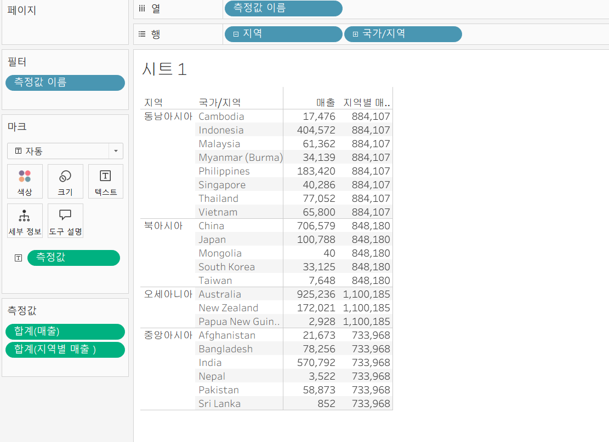

2. FIXED에서 설정한 차원이 뷰에 포함되어 있지 않을때 
현재 뷰에서 각 지역별 매출을 나타내고 있을때 제품 범주 차원에 따라 매출을 표시하고 싶을때  
계산된 필드에서 { FIXED [범주] : SUM([매출]) } 범주별 매출 


제품별 매출 구성 비율 나타내기
1. 퀵 테이블 계산
현재 뷰에서 매출을 세부 수준이 제품의 범주 기준으로 구성 비율을 나타냈기 때문에 하위 범주 제외하면 제외한 하위 범주 이외의 하위 범주들을 통해 구성 비율 계산  


2. FIXED 함수 이용하기 
하위 범주를 뷰에서 제외해도 계산할 때 하위 범주들을 포함해 계산 
{FIXED : SUM([매출])} 전체 매출 필드 만들기 
LOD 표현식에서 차원 입력하지 않을 시 전체 데이터 기준에 따라 계산 
SUM([매출])/SUM([전체 매출]) 제품 구성 비율 필드 만들기 -> 우클릭 -> 기본 속성 -> 숫자 형식 -> 백분율 -> 더블 클릭

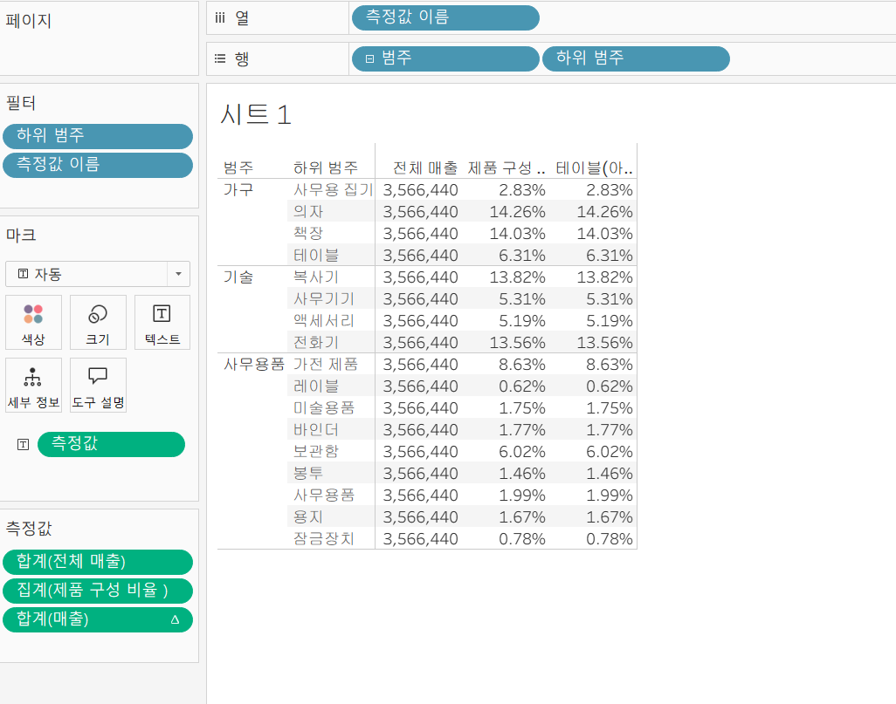 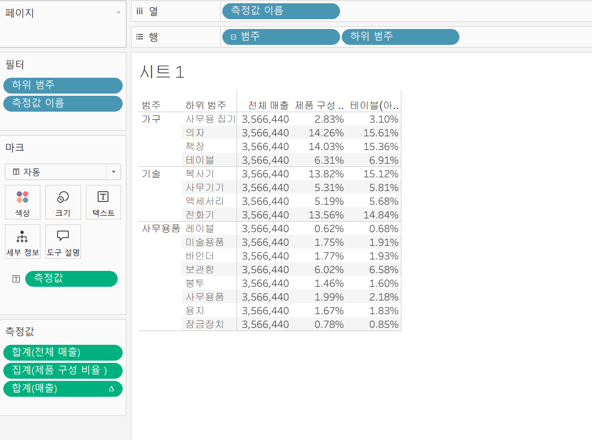


## 40. LOD EXCLUDE

EXCLUDE LOD : 현재 뷰에서 특정 차원 제외하여 계산할 때 사용

각 제품의 하위 범주에 따라 매출 확인하는 뷰가 있을때, 
여기서 제품의 범주별 매출을 보려면 FIXED 또는 EXCLUDE 사용해야함 
1. FIXED 사용 - 범주별 매출(FIXED)
{FIXED [범주] : SUM([매출])} 
2. EXCLUDE 사용 - 범주별 매출(EXCLUDE)
{EXCLUDE [하위 범주] : SUM([매출])} 

> **🧞‍♀️ FIXED와 EXCLUDE을 사용하는 경우의 차이가 무엇인가요?**

하위 범주를 제조업체 수준으로 나타내면 FiXED 사용한 값은 변경되지 않지만 EXCLUDE 사용한 값인 경우는 값이 변경됨 
EXCLUDE 는 하위 범주 차원을 무시하고 매출의 합계를 표시하긴 하지만 현재 뷰에 있는 제조업체 차원이 하위 범주보다 세부 수준이 더 낮아서 제조업체 기준으로 관련된 매출 표시 

FIXED 는 현재 뷰와 관계없이 특정 차원을 사용해 계산하기 때문에 필터의 영향을 받지 않음 
EXCLUDE 는 뷰에 있는 차원을 따라 계산하기 때문에 관련 차원을 필터로 걸면 필터의 영향을 받음 


<하위 범주에 있는 제품 중 한 제품 매출 기준으로 다른 제품들의 매출과 차이 비교>

eg 액세서리 매출 기준으로 다른 제품들의 매출 비교 

1. 액세서리 매출 필드 생성 
IF [하위 범주] = "액세서리" THEN [매출] END  
2.  EXCLUDE 하위 범주 매출
{EXCLUDE [하위 범주] : SUM([액세서리 매출])} -> 하위 범주 차원 무시하고 액세서리 매출 값만 반환 
3. 각 제품들의 매출과 액세서리 매출 차이 계산하는 필드 생성 
각 제품별 매출과 액세서리 매출의 차이
SUM([매출]) - ATTR([EXCLUDE 하위 범주 매출])

생성된 필드 더블 클릭한 후에 ctrl 누른채 마크 카드 색상에 드래그 앤 드롭하면 모든 제품들의 매출들이 액세서리 매출 기준으로 얼마나 차이 나는지 확인가능 

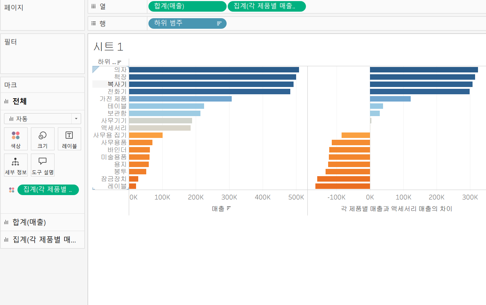

> **🧞‍♀️ 왜 ATTR 함수를 사용하나요?**

```
여기에 답을 적어주세요!
```


## 41. LOD INCLUDE

INCLUDE 현재 뷰에서 특정 차원을 추가하여 계산 
EXCLUDE 와 같이 차원 필터를 통해 해당 값 변경 가능 

<각 도시의 고객당 평균 매출 확인>
(시트1)
1. 국가, 주문 ID 필드 행 선반에 드래그 앤 드롭하고 국가 필드 시/도 필드 기준으로 표시
2. 매출 필드 더블클릭 후 분석 패널 총계 더블클릭 
3. 분석 탭의 총계에 총계 다음의 계산 표시에서 평균 선택 
-> 뷰에서 각 도시의 고객당 평균 매출을 표시하고 있지만 해당 값들은 따로 필드를 생성한 게 아니기 때문에 값을 재사용 하기 위해 INCLUDE LOD 표현식 사용 

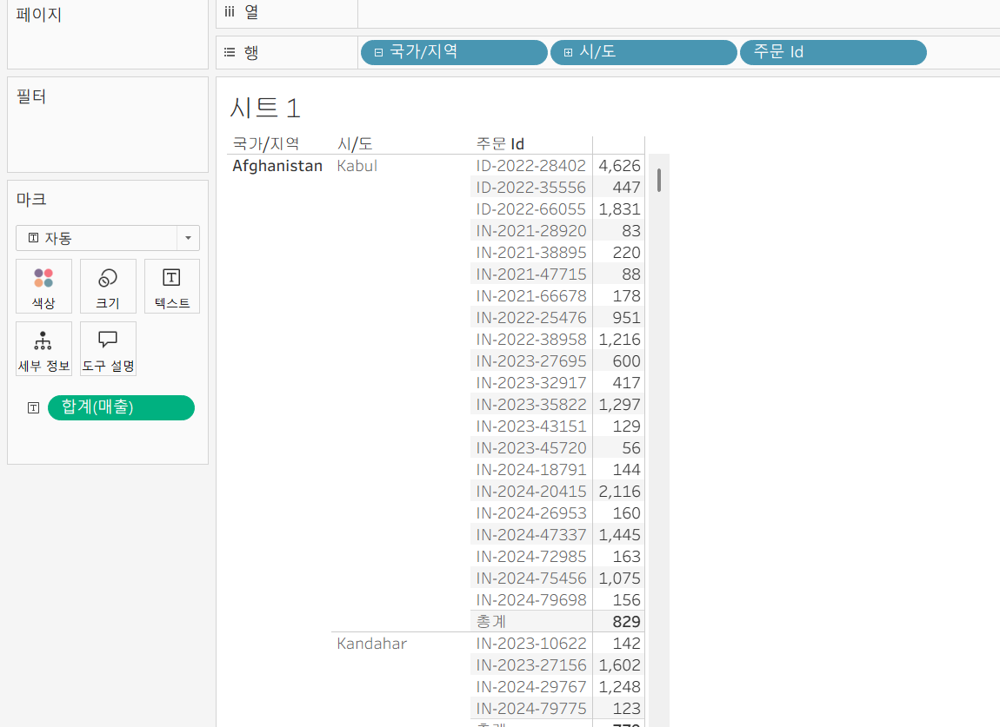

(시트2)
새로운 시트 생성하고 주문 ID에 따른 평균 매출 필드 생성 
AVG( {INCLUDE[주문 Id] : SUM([매출])})
주문 ID 차원을 포함해서 합계한 매출에 평균을 반환한다는 의미 

국가 필드 행 선반에 드래그 앤 드롭 -> 필드를 시/도 필드 기준으로 표시 -> 생성된 필드 더블클릭 
-> 각 도시의 고객당 평균 매출 표시 

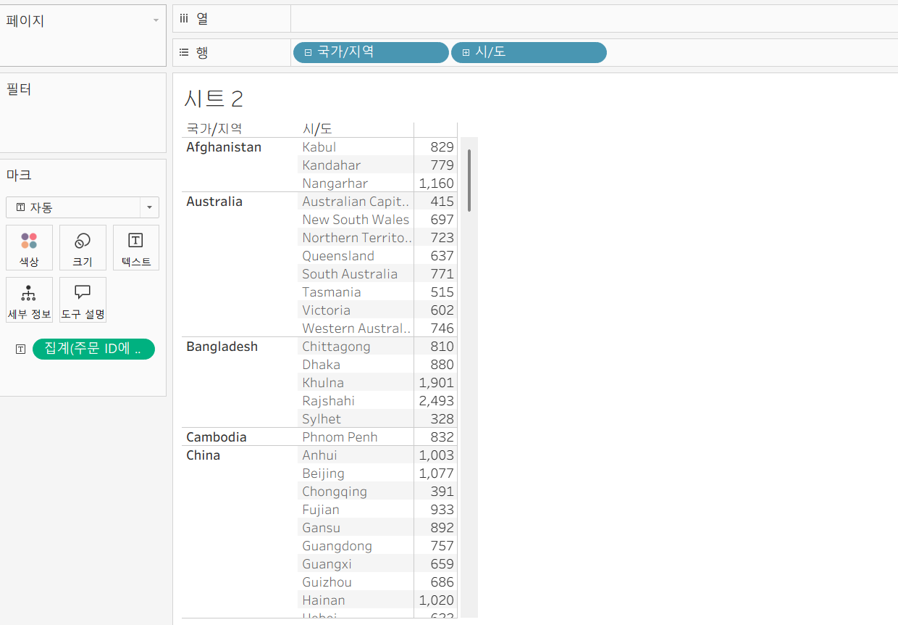

주문 ID 차원을 현재 뷰에서 표시하지 않지만 LOD 표현식을 통해 해당 차원 계산에 추가 가능 

FIXED 사용시 
AVG( {FIXED [주문 Id] : SUM([매출])}) 로 필드 생성하면 동일한 결과 나옴 


> **🧞‍♀️ 그렇다면 어떤 경우에 각 표현식을 사용하나요? 예시와 함께 적어보아요**

뷰에 표시되는 값이 차원이면 FIXED LOD 표현식만 사용 가능 
FIXED LOD 표현식은 차원과 측정값을 반환할 수 있는데 INCLUDE, EXCLUDE LOD 표현식들은 측정값만 반환 

반환 값을 차원 필터의 영향을 받게 되는 경우에는 INCLUDE 또는 EXCLUDE LOD 표현식 사용해야함 
FIXED LOD 표현식은 차원 필터에 영향 받지 않음 

## 42. 매개변수

매개변수란?

고정된 상수가 아닌 동적인 값으로 변경하기 위해 활용하는 기능 
반드시 계산식, 필터, 참조선과 함께 사용

매출이 높은 상위 10개의 제품에서 5개로 변경하고 싶으면 필터 편집에서 숫자를 바꿔도 되지만, 사용자 입자에서 여러 단계를 거쳐야 하는 번거로움 존재 

매개변수 만들기
1. 필터 이용
드롭다운 -> 새 매개 변수 만들기 
2. 원하는 필드 위에 마우스 우클릭 -> 만들기 -> 매개변수 
3. 데이터 패널 이용 
상위 제품 범주 매개변수 만들기 
데이터 유형 : 정수
현재 값: 5 
허용 가능한 값 : 전체 

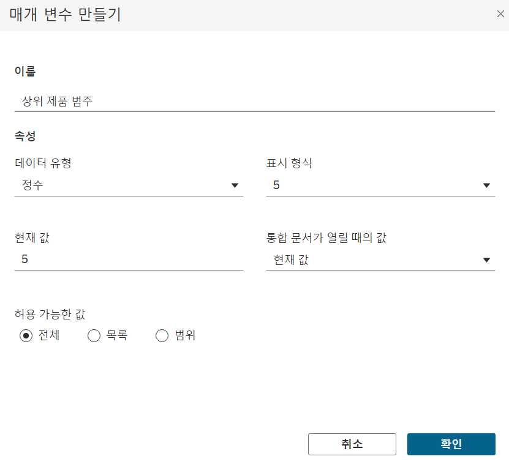

생성한 필드 마우스 우클릭 -> 매개 변수 표시 -> 뷰를 기준으로 오른쪽에 상위 제품 범주 카드가 5로 표시되어 있으나 현재 뷰에서는 상위 10개 제품들이 표시됨 

하위 범주 필터 마우스 우클릭 -> 필터 편집 -> 기준값 상위 제품 범주 매개변수로 설정 -> 매개 변수 카드에 상위 N개를 표시하면 해당 값에 따라 뷰 변경됨 

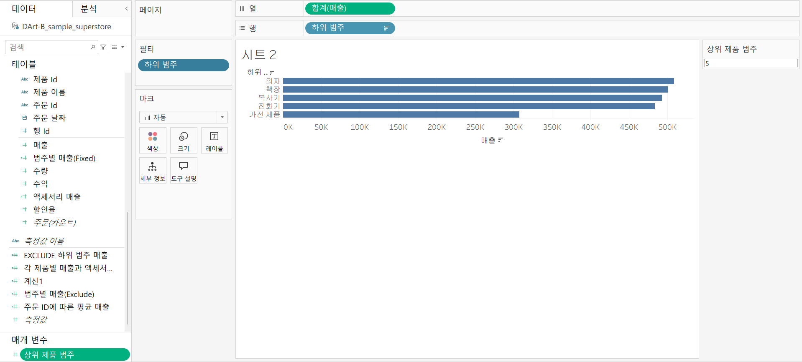


> **🧞‍♀️ 집합에도 매개변수를 적용할 수 있나요? 시도해봅시다**
필터 제거 후 하위 범주 필드에 마우스 우클릭 -> 만들기 -> 집합 -> 상위 탭에서 필드 기준을 상위 제품 범주로 설정 -> 생성된 집합 필드 마크 카드 색상 위에 드래그 앤 드롭 
-> 상위 제품들이 매개 변수의 값에 따라 색상으로 구분됨 


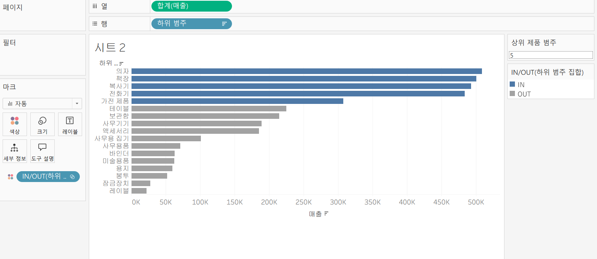

## 43. 매개변수 실습
<!-- 영상 묶음에 포함되지 않아 찾기 어려우실까 링크를 아래에 첨부하겠습니다. 수강 후 삭제해주세요-->

### < 계산식을 활용하여 매개 변수 실습 >  

매출 필드 열 선반 , 국가 필드 행 선반에 드래그 앤 드롭 
-> 각 국가별 매출 나타냄

Q. 뷰에 표시되어 있는 차원 변경하려면? 
행 선반에 원하는 필드 드래그 앤 드롭 하는 방법말고 매개변수 활용 가능 

#### < 차원을 활용하여 매개 변수 만들기 실습 > 

<매개 변수 만들기>
데이터 패널의 "매개 변수 만들기" 클릭 -> 이름 "차원 선택하기"로 입력 -> 데이터 유형 "문자열", 허용 가능한 값 "목록" 선택, "국가", "제품 제조사", "고객", "세그먼트" 입력하고 확인 누르기 
-> 만든 매개변수에 마우스 우클릭하여 "매개 변수 표시" 선택

<매개 변수 작동시킬 계산된 필드 만들기>
계산된 필드 이름 "차원 선택"으로 설정 

CASE [차원 선택하기]
WHEN '국가' THEN [국가/지역]
WHEN '제품 제조사' THEN [제조업체]
WHEN '고객' THEN [고객 이름]
WHEN '세그먼트' THEN [세그먼트]
END

식 설명: "차원 선택하기" 매개 변수에서 "국가"를 선택하면 "국가/지역" 데이터가 나오고 "제품 제조사"를 클릭하면 "제조업체"가 나오도록 계산식 작성  

만든 "차원 선택" 필드를 행 선반에 필드 위로 드래그 앤 드롭하면 매개변수에서 선택한 값으로 데이터가 변경됨 

<매개 변수에 따른 제목 변경 되도록 설정>
해당 시트 상단의 제목 더블 클릭 -> 삽입 -> 매개변수. 차원 선택하기 
-> 보고자 하는 매개 변수값을 선택하면 뷰에 있는 시트의 제목에서 선택한 차원으로 제목이 변경됨 

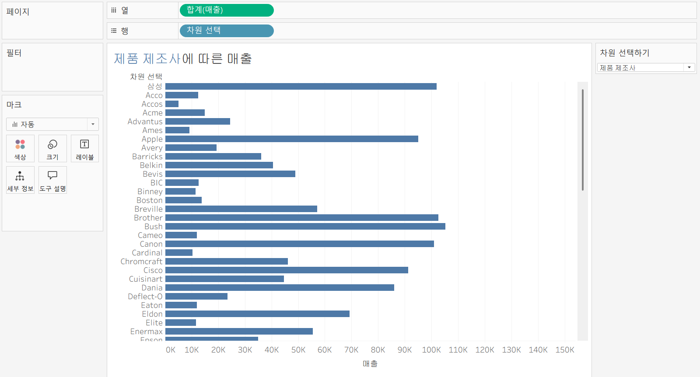

#### < 측정값을 활용하여 매개 변수 만들기 실습 > 
<매개변수 만들기>
데이터 패널의 "매개 변수 만들기" 클릭 -> 이름 "측정값 선택하기"으로 입력 -> 데이터 유형 "문자열", 허용 가능한 값 "목록" 선택, "매출","수량","수익" 입력하고 확인 누르기

<계산된 필드 만들기>
이름 : "측정값 선택"

CASE [측정값 선택하기]
WHEN '매출' THEN SUM([매출])
WHEN '수량' THEN SUM([수량])
WHEN '수익' THEN SUM([수익])
END

만든 필드 열 선반에 필드 위로 드래그 앤 드롭하고 측정값 매개 변수 표시하면 뷰에서 그래프 변경되는 것 확인 가능 

<그래프 이름 변경>
시트 제목 더블 클릭 -> "매출" 대신 "<매개 변수.측정값 선택하기> 입력

<각각의 측정값에 단위 표시>
1. "측정값 선택" 필드 복제해 이름 "흑정값 단위"로 입력 
2. 계산식에서 매출과 수량을 선택하면 각각의 단위가 나오도록 작성
3. CASE [측정값 선택하기]
WHEN '매출' THEN '원'
WHEN '수량' THEN '개'
WHEN '수익' THEN '원'
END
4. 측정값 선택 , 측정 값 단위 필드 마크 카드 레이블에 드래그 앤 드롭 
5. 텍스트 수정 : 마크 카드 "레이블" 클릭해 편집 화면에 들어가서 텍스트 변경 
<집계(측정값 선택)> ----> <집계(측정값 선택)><측정값 단위>
<측정값 단위>

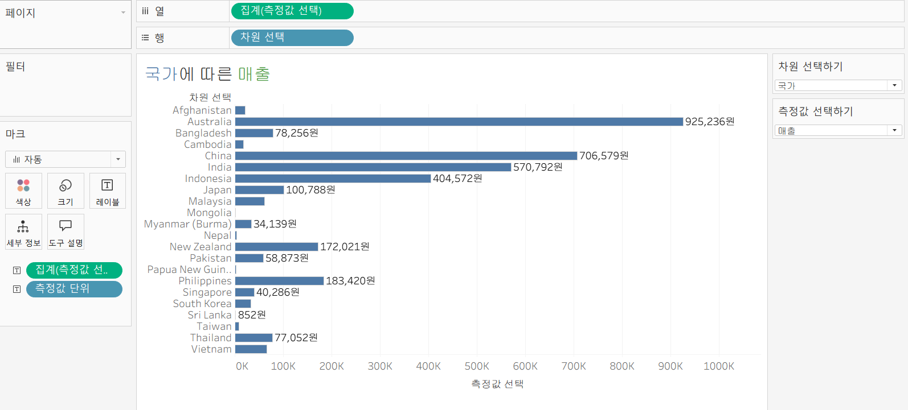


## 44. 매개변수 실습

<!-- 매개변수에 대해 알게 된 점을 적어주세요 -->

### < 참조선을 활용하여 매개 변수 실습 > 
매출 필드 열 선반, 국가 필드 행 선반에 드래그 앤 드롭
분석 패널에 참조선을 뷰로 드래그 -> 참조선 편집 화면 나타남
-> 라인 값 매개변수로 설정

매개변수 이름 "목표 매출"로 입력하고 확인
-> 매개 변수에서 값을 입력하면 해당 값에 따라 참조선이 변경됨

<목표 매출 달성 & 미달성한 국가들을 색상으로 구분하기>
1. 계산된 필드 만들기
필드 이름 : "KPI"
IF SUM([매출]) >= [목표 매출]
THEN '목표 달성'
ELSE '목표 미달성'
END
2. 만들어진 필드 마크 카드 색상에 드래그 앤 드롭

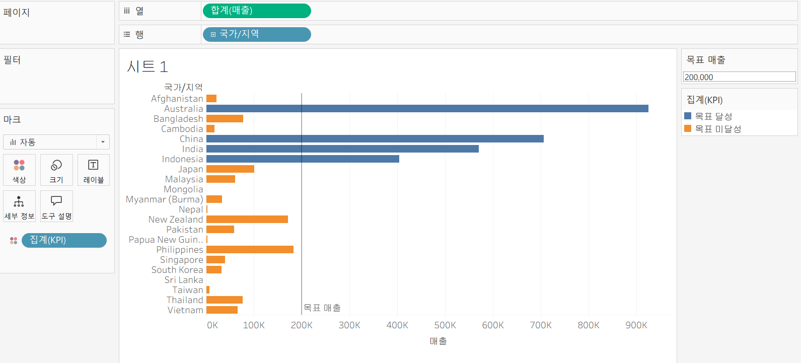

<그래프에서 시작 날짜와 마지막 날짜를 선택할 수 있도록 한 다음에 해당 날짜 범위에 매출 합계를 나태내기>

1. 매출 필드 행 선반에 놓기
2. 주문 날짜 필드 마우스 우클릭 한 채로 열선반에 드래그 앤 드롭 -> 연속형 "월(주문 날짜)" 선택
3. 시작 날짜와 마지막 날짜에 대한 매개 변수 만들기
첫번째 매개 변수 "시작 날짜"로 입력
데이터 유형 "날짜" 선택, 해당 매개 변수 복제해 "마지막 날짜" 매개 변수 만들기
4. 분석 패널에서 "참조 구간" 뷰로 드래그해서 테이블 주문 날짜 위로 놓기 -> 참조선 편집 화면에서 시작 구간에 "시작 날짜" 매개변수, 끝 구간에 "마지막 날짜" 매개 변수 선택 -> 라인 첫번째 옵션 선택
5. 만든 매개변수 우클릭 -> "매개 변수 표시" 하고 해당 날짜들을 변경해보면 뷰에서 설정한 날짜 범위가 하이라이트 되어 보여짐

6. 해당 날짜 범위의 매출 합계를 그래프 제목에 나타내기
계산된 필드 "날짜 범위의 매출 합계"
TOTAL(SUM(IF [주문 날짜] >= [시작 날짜] AND [주문 날짜] <= [마지막 날짜] THEN [매출] END))

생성된 필드 마크 카드 세부 정보에 드래그 앤 드롭

그래프 제목 더블 클릭 

<매개 변수.시작 날짜>부터 <매개 변수.마지막 날짜>까지
매출 합계: <집계(날짜 범위의 매출 합계)>

-> 두 매개변수 날짜 변경해보면 제목의 매출 합계 값이 변경되고 있다는 것을 알 수 있음 

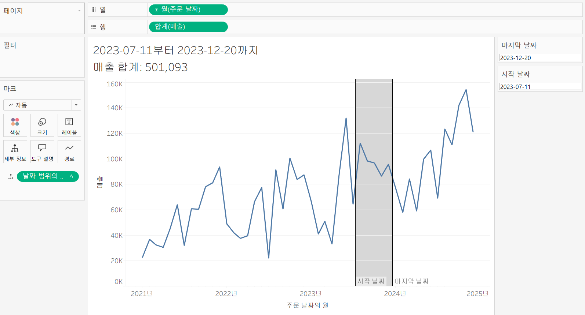

## 45. 워크시트 마크카드

<!-- 마크카드에 대해 알게 된 점을 적어주세요 -->

Tableau에 작업 영역인 워크시트에서 차트를 만들게 되면 해당 시트 안에 있는 데이터들을 "마크"라 하는데 마크의 서식들을 변경하기 위해서는 "마크 카드" 활용해야함 

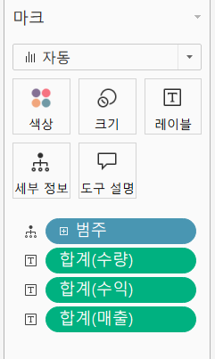

드롭 다운: 보면 마크의 표현 방식 선택 
색상: 마크 색상, 투명도, 테두리 설정
크기: 마크 크기 조정 
레이블 : 범례 설정
세부 정보: 불연속형 필드 사용시 해당 차트에서 데이터 구분해 표시 / 연속형 필드 사용시 도구 설명에 데이터 추가 
도구 설명 : 도구 설명 텍스트 수정 가능 

여섯 번째 칸은 그래프 유형마다 달라짐 
필드 왼쪽에 표시되어 있는 기호는 해당 필드가 어떤 마크 옵션이 적용되어 있는지 확인 가능 


## 46. 서식 계층

<!-- 서식계층에 대해 알게 된 점을 적어주세요 -->

> **🧞‍♀️ 서식계층을 일반적인 것에서 구체적인 것 순서로 기입해보세요**

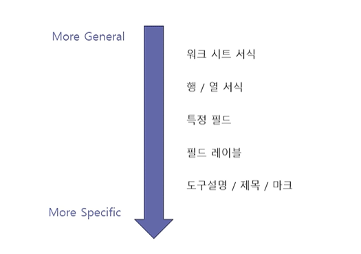

해당 서식 계층에서 상위 계층에 서식을 설정했을 때 상위 계층보다 아래 계층인 경우에 서식을 변경하게 되면 해당 아래 계층에 설정한 서식이 적용됨 

<간단한 실습>

1. 지역 필드 행 선반, 범주 필드 열 선반에 드래그 앤 드롭 
2. 지역 필드를 국가 필드 기준으로 표시
3. 매출 필드 더블클릭 

해당 통합문서 내에 일괄적으로 글꼴 전부 적용하고 싶다면?
서식 탭 -> 통합 문서 -> 원하는 글꼴로 설정

1. 워크 시트 서식 - 전체 서식 변경

2. 행 / 열 서식 - 행 또는 열 서식 변경, 시트 탭에서 글골 색상을 파란색으로 변경해도 행 서식 변화 x (아래 계층이기 때문에)

3. 특정 필드 서식
서식 패널 상단 필드 클릭 -> 서식 변경할 필드 선택 -> 뷰에서 마우스 우클릭해 서식 선택

4. 필드 레이블 서식
해당 필드 레이블에 마우스 우클릭해 서식 클릭하면 왼쪽에 서식 패널 나타남 

5. 마크와 제목 서식 
마크 카드 텍스트에서 서식 변경 가능

서식 지우기 : "서식" 탭 -> "워크시트 서식 지우기" -> 마크 카드에서 설정한 서식 이전에 설정한 서식들은 모두 사라짐 


## 47. 워크시트 서식

<!-- 워크시트 서식에 대해 알게 된 점을 적어주세요!-->
상단의 "서식" 탭 클릭 시 옵션 

1. 글꼴: 워크시트 내 표시되어 있는 텍스트들의 글꼴, 색상 ,크기 설정 가능

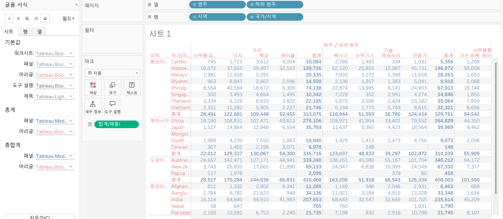

2. 맞춤: 워크시트 내 표시되어 있는 텍스트들의 정렬과 방향 설정 

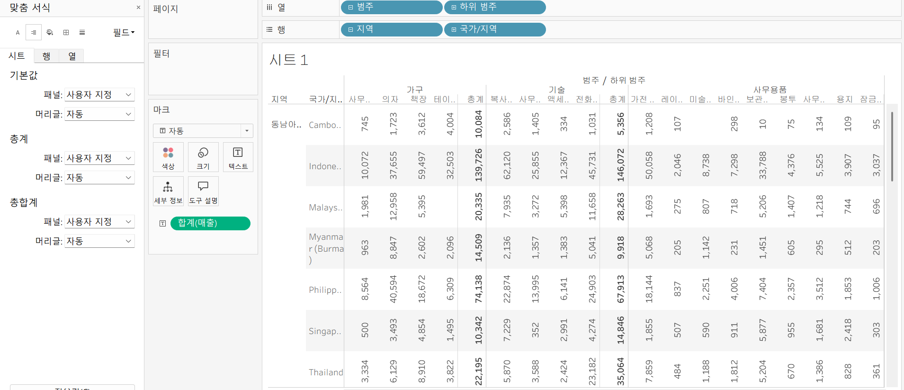

3. 음영: 워크시트 내 표시된 데이터 셀에 음영 적용

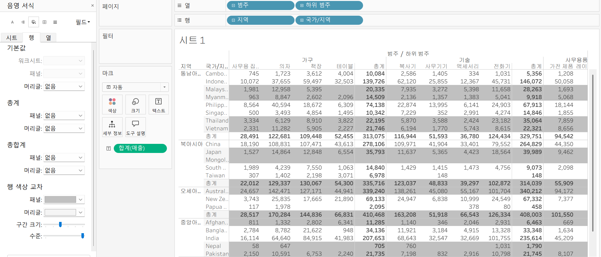

## 문제 리스트


## 문제 1.

```
가장 많이 주문한 사람들은 물건 배송을 빨리 받았을까요?
조건을 준수하여 아래 이미지를 만들어봆시다.
1) 국가/지역별(이하 '나라'로 통칭), 범주별로 배송일자가 다를 수 있으니 먼저, 나라별/범주별로 평균 배송일자를 설정한 뒤,
2) 각 나라에서 가장 많이 주문한 사람의 이름을 첫 번째 열,
3) 그 사람이 주문한 제품 이름을 2번째 열,
4) 각 상품이 배송까지 걸린 날 수를 표현하고
5) 그리고 만약 배송이 각 나라/범주별 평균보다 빨랐다면 '빠름', 같다면 '평균', 느리다면 '느림' 으로 print 해주세요. 
```


<!-- 여기까지 오는 과정 중 알게 된 점을 기입하고, 결과는 시트 명을 본인 이름으로 바꾸어 표시해주세요.-->

## 문제 2.

```
채원이는 태블로를 쓰실 수 없는 상사분께 보고하기 위한 대시보드를 만들고 싶어요. 

제품 중분류별로 구분하되 매개변수로써 수익, 매출, 수량을 입력하면 저절로 각각 지표에 해당하는 그래프로 바뀌도록 설계하고자 해요.

 어떤 값이 각 지표의 평균보다 낮은 값을 갖고 있다면 색깔을 주황색으로, 그것보다 높다면 파란색으로 표시하고 싶어요. 그 평균값은 각 지표별로 달라야 해요.
```


<!-- 예시 사진은 지워주세요-->