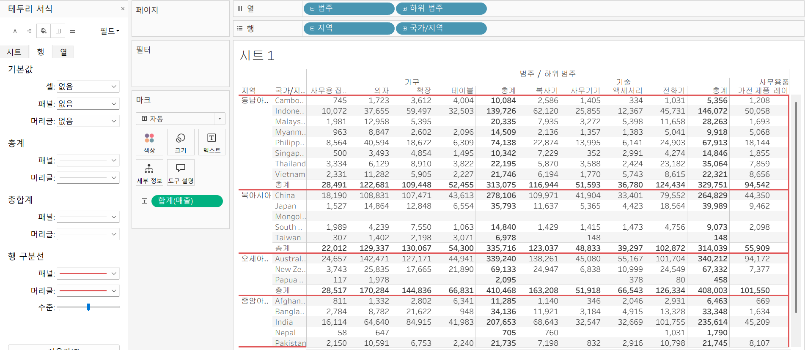
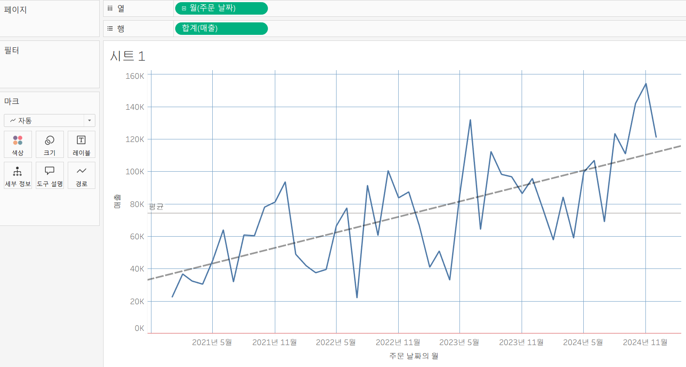
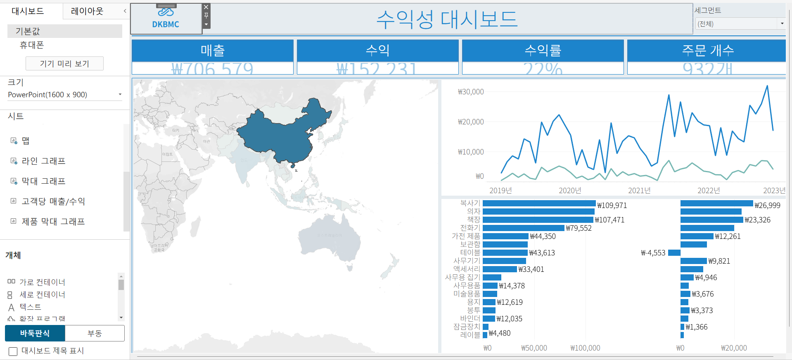
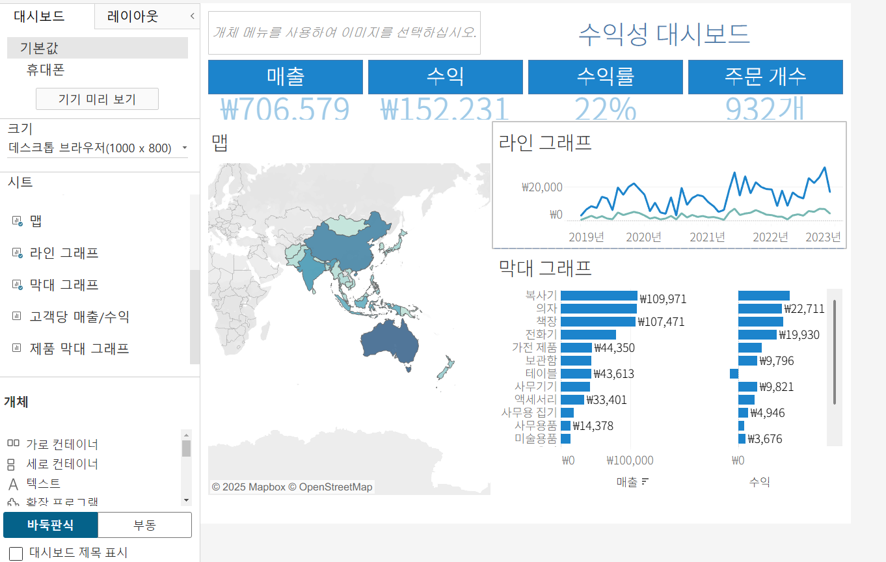
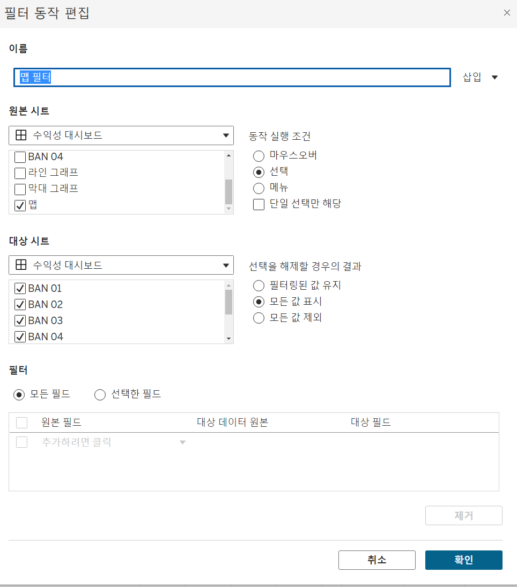
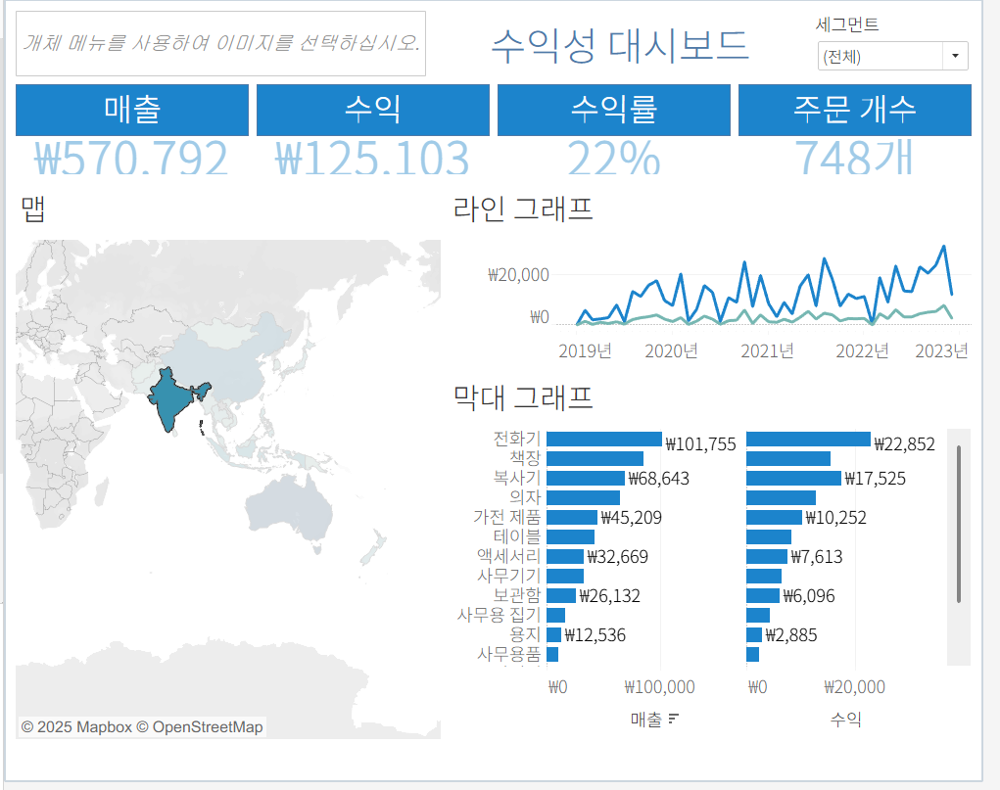

# Sixth Study Week

## Study Schedule
 

| 회차 | 강의 범위   | 강의 이수 여부 | 링크                                                                                                     |
|------|-------------|----------------|--------------------------------------------------------------------------------------------------------|
| 1    | 1~7강       | ✅              | [링크](https://www.youtube.com/watch?v=AXkaUrJs-Ko&list=PL87tgIIryGsa5vdz6MsaOEF8PK-YqK3fz&index=84)    |
| 2    | 8~17강      | ✅              | [링크](https://www.youtube.com/watch?v=AXkaUrJs-Ko&list=PL87tgIIryGsa5vdz6MsaOEF8PK-YqK3fz&index=75)    |
| 3    | 18~27강     | ✅              | [링크](https://www.youtube.com/watch?v=AXkaUrJs-Ko&list=PL87tgIIryGsa5vdz6MsaOEF8PK-YqK3fz&index=65)    |
| 4    | 28~37강     | ✅              | [링크](https://www.youtube.com/watch?v=e6J0Ljd6h44&list=PL87tgIIryGsa5vdz6MsaOEF8PK-YqK3fz&index=55)    |
| 5    | 38~47강     | ✅              | [링크](https://www.youtube.com/watch?v=AXkaUrJs-Ko&list=PL87tgIIryGsa5vdz6MsaOEF8PK-YqK3fz&index=45)    |
| 6    | 48~57강     | ✅              | [링크](https://www.youtube.com/watch?v=AXkaUrJs-Ko&list=PL87tgIIryGsa5vdz6MsaOEF8PK-YqK3fz&index=35)    |
| 7    | 58~67강     | 🍽️             | [링크](https://www.youtube.com/watch?v=AXkaUrJs-Ko&list=PL87tgIIryGsa5vdz6MsaOEF8PK-YqK3fz&index=25)    |
| 8    | 68~77강     | 🍽️             | [링크](https://www.youtube.com/watch?v=AXkaUrJs-Ko&list=PL87tgIIryGsa5vdz6MsaOEF8PK-YqK3fz&index=15)    |
| 9    | 78~85강     | 🍽️             | [링크](https://www.youtube.com/watch?v=AXkaUrJs-Ko&list=PL87tgIIryGsa5vdz6MsaOEF8PK-YqK3fz&index=5)     |
---

 
<!-- 여기까진 그대로 둬 주세요-->

## 48. 워크시트 서식(2)

<!-- 워크시트에 관해 본 강의에서 알게 된 점을 적어주세요 -->

1. "테두리" : 뷰에 표시된 차트의 테두리 유형, 두께, 색상 설정 가능 
뷰에서 테이블, 패널, 셀 및 머리글을 둘러싸는 라인의 서식을 설정 가능

2. "라인": 뷰에서 표시된 데이터의 축에 대한 라인의 모양 설정 가능 
라인의 유형, 두께, 색상 설정 가능 

## 49강. 대시보드패널

<!-- 대시보드패널 강의에서 알게 된 점을 적어주세요. -->

<대시보드 패널 구성>

"크기" : 현재 대시보드 크기 설정
고정된 기본 크기들(대시보드를 자주 표시하는 크기들로 구성), 화면을 채우는 자동 크기, 크기 범위 선택 가능 

"시트" : 대시보드에서 사용할 수 있는 워크시트 확인
새로운 워크시트 만들면 "시트" 항목에 자동으로 추가됨
여러 시트들 중 하나를 대시보드로 드래그 앤 드롭 하면 대시보드에 시트가 자동으로 채워짐 
다른 시트를 드래고 앤 드롭하면 하이라이트로 시트 공간 구분이 표시됨 
사용자가 만들었던 시트 외에 Tableau가 지원하는 다른 개체 추가 가능 

"개체" : 유용한 개체들 모음, 드래그 앤 드롭으로 대시보드에 사용 가능 

- 제목은 텍스트 상자 개체를 대시보드에 드래그 앤 드롭
- 이미지 넣으려면 이미지 개체 드래그 앤 드롭해 이미지 파일 삽입 or 링크로 표시 
- 웹 페이지 개체 드래그 앤 드롭해 웹사이트 경로 입력 

* 원하는 디바이스별 해상도 적용 : "기기 미리 보기" -> 기기 유형, 모델(해상도) 선택 

## 50. 대시보드 구성방식

<!-- 알게 된 점을 적고, 아래 질문에 답해보세요 :) -->

> **🧞‍♀️ 부동과 바둑판식 방식을 차이를 중점으로 기술해보세요**

개체 추가 방식 
1. 부동 : 개체 추가 시 자유롭게 배치 가능
추가한 개체를 움직이더라도 다른 개체의 크기나 모양에는 영향을 주지 않음
-> 대시보드 크기가 자주 변경되지 않고 그래프 내에 빈 공간이 많은 경우에 사용 

2. 바둑판식 : 개체 추가 시 격자무늬 구조에 따라 개체들을 구성, 개체 추가한 후에 다른 개체들의 크기가 변경됨 
-> 대시보드 크기가 자주 변경되는 경우에 사용

## 51. 대시보드 컨테이너

개체를 대시보드에 배치하기 전에 컨테이너를 먼저 배치할 수 있음 
컨테이너란 ?
대시보드 개체들과 워크시트들을 그룹화하고 구성할 수 있는 공간

컨테이너의 종류
1. 가로 컨테이너 : 내부의 개체들을 수평 공간으로 배열할 때 사용
2. 세로 컨테이너: 내부의 개체들을 수직 공간으로 배열할 때 사용

샘플 수익성 대시보드를 보면 관련된 워크시트들과 개체들이 위에서 아래로 쌓이는 것을 볼 수 있음  
제목이 있는 첫 번째 행, 큰 값 배너가 있는 두 번째 행, 맵과 그래프가 있는 마지막 행으로 구성 

<만드는 법>
1. 새 대시보드에 세로 컨테이너 드래그, 빈 페이지 개체 공백 채우기로 배치
2. 첫번째 행 만들기: 가로 컨테이너 대시보드 공간으로 드래그 앤 드롭 -> 텍스트 개체 가로 컨테이너에 배치 -> "수익성 대시보드" 입력 후 글꼴 크기 20으로 변경 -> 텍스트 개체 옆에 이미지 개체 배치  
3. 두번째 행 만들기: 가로 컨테이너 제목이 있는 컨테이너 아래에 배치 -> 값을 가지고 있는 워크시트들을 가로 컨테이너에 드래그 앤 드롭 

* 컨테이너 크기 조정하려면 배너 하나를 클릭하고 개체 잡는 부분을 더블 클릭하면 배너들을 가지고 있는 컨테이너가 선택됨 -> 기타 옵션 -> 높이 편집에서 100 입력 -> 배너 사이즈 변경됨 
 
4. 세번째 행 만들기: 가로 컨테이너 배치 -> 맵 차트 해당 컨테이너에 드래그 앤 드롭 -> 맵 차트 오른쪽에 세로 컨테이너 배치 -> 라인 & 막대 그래프 드래그 앤 드롭

## 52. 레이아웃 패널

- 레이아웃 탭 : 대시보드의 개체 속성 변경
그래프 중 하나 클릭하고 "레이아웃" 탭을 클릭하면 해당 개체에 변경할 수 있는 옵션이 나타남 

- 제목 표시 : 그래프의 제목 표시 여부 결정 
부동 : 선택한 개체를 부동 개체로 변경. 옵션 선택 시 선택한 개체는 자리에서 나와 개체를 자유롭게 이동할 수 있음

부동 옵션 아래의 "위치"와 "크기" 옵션을 통해 개체의 위치와 크기를 픽셀 단위로 변경 가능 <- 부동 개체에만 적용

※ 부동 옵션 선택 해제하면 해당 개체가 이전의 위치로 돌아가지 않음

- 테두리: 개체 테두리의 선 유형 , 두께 및 색상 변경 

- 항목 계층: 대시보드에 있는 컨테이너와 개체를 보여줌
항목 계층에서 개체를 클릭하면 대시보드에서 선택된 개체를 확인할 수 있음 

## 53. 필터 동작

<!-- 필터 동작에 대해 알게 된 점을 적어주세요 -->

대시보드에 필터 추가하는 방법

1. 차트 클릭 -> 드롭다운 메뉴에서 -> "필터" 옵션 선택 -> 대시보드에 표시하고자 하는 필터 선택 

대시보드 동작 -> 각각의 워크시트들이 서로 연계되어 표현하기 위함  
2. "대시보드" 탭 "동작" 클릭 -> 전체 통합 문서에 있는 대시보드 동작 확인 가능 -> "동작 추가" 6가지 동작 옵션 중 하나 선택 

"필터 동작" 만들기 
이름 : 맵 필터
현재 작업 중인 대시보드 선택 후 "맵 차트" 워크시트만 선택 
-> 동작 실행 조건 설정 
- 1. 마우스 오버: 차트의 마크 위에 마우스를 놓으면 나머지 데이터가 해당 마크의 데이터로 변경 
- 2. 선택: 차트의 마크를 클리갛며 나머지 데이터가 선택한 마크의 데이터로 변경: 
- 3. 메뉴: 마크를 클릭할 때 마크의 도구 설명에 텍스트 나타나고 옵션을 선택할 때 나머지 데이터 변경 
-> "선택" 옵션 선택 
-> "대상 시트" : 동작을 실행하면 변경할 워크시트 선택. 현재 대시보드의 나머지 워크시트를 변경하려면 모든 워크시트 체크
-> "선택을 해제할 경우의 결과"에 "모든 값 표시" 선택 

-> 맵 차트에 국가를 선택하면 관련된 데이터가 표시되고 국가 선택을 해제하면 전체 데이터가 다시 표시되는 것을 확인할 수 있음 

- 대시보드 필터 동작 추가 다른 방법? 
차트 선택 -> "필터로 사용" 기호 클릭 -> 대시보드 동작 리스트에 동작 추가됨 -> 이전에 만든 것과 동일한 결과 나타남 

## 54. 대시보드 하이라이터 동작

<!-- 하이라이터에 대해 알게 된 점을 적어주세요 -->

## 55. 대시보드 URL

<!-- URL에 대해 알게 된 점을 적어주세요 -->

## 56. 대시보드 시트에 이동 동작

<!-- 대시보드 시트에 이동에 대해 알게 된 점을 적어주세요!-->

## 57. 매개변수 변경 동작

<!-- 매개변수 변경 동작에 대해 알게 된 점을 적어주세요!-->

## 문제

오늘은 별도의 문제가 없습니다. 

여러 대시보드를 참고하시어, superstore 데이터를 사용해 나만의 대시보드를 제작해주세요.

**단, 워크시트 3개 이상의 그래프를 표시해야 하며 각 시트 간 상호작용성 필터 or 하이라이트 동작은 꼭 추가되어야 합니다**

어떤 부분에 가중을 두었는지, 어떤 사용자 편의성을 고려하였는지에 대한 설명이 필요합니다.
