# 7th Study Week

## Study Schedule
 

| 회차 | 강의 범위   | 강의 이수 여부 | 링크                                                                                                     |
|------|-------------|----------------|--------------------------------------------------------------------------------------------------------|
| 1    | 1~7강       | ✅              | [링크](https://www.youtube.com/watch?v=AXkaUrJs-Ko&list=PL87tgIIryGsa5vdz6MsaOEF8PK-YqK3fz&index=84)    |
| 2    | 8~17강      | ✅              | [링크](https://www.youtube.com/watch?v=AXkaUrJs-Ko&list=PL87tgIIryGsa5vdz6MsaOEF8PK-YqK3fz&index=75)    |
| 3    | 18~27강     | ✅              | [링크](https://www.youtube.com/watch?v=AXkaUrJs-Ko&list=PL87tgIIryGsa5vdz6MsaOEF8PK-YqK3fz&index=65)    |
| 4    | 28~37강     | ✅              | [링크](https://www.youtube.com/watch?v=e6J0Ljd6h44&list=PL87tgIIryGsa5vdz6MsaOEF8PK-YqK3fz&index=55)    |
| 5    | 38~47강     | ✅              | [링크](https://www.youtube.com/watch?v=AXkaUrJs-Ko&list=PL87tgIIryGsa5vdz6MsaOEF8PK-YqK3fz&index=45)    |
| 6    | 48~57강     | ✅              | [링크](https://www.youtube.com/watch?v=AXkaUrJs-Ko&list=PL87tgIIryGsa5vdz6MsaOEF8PK-YqK3fz&index=35)    |
| 7    | 58~66강     | ✅             | [링크](https://www.youtube.com/watch?v=AXkaUrJs-Ko&list=PL87tgIIryGsa5vdz6MsaOEF8PK-YqK3fz&index=25)    |
| 8    | 67~77강     | 🍽️             | [링크](https://www.youtube.com/watch?v=AXkaUrJs-Ko&list=PL87tgIIryGsa5vdz6MsaOEF8PK-YqK3fz&index=15)    |
| 9    | 78~85강     | 🍽️             | [링크](https://www.youtube.com/watch?v=AXkaUrJs-Ko&list=PL87tgIIryGsa5vdz6MsaOEF8PK-YqK3fz&index=5)     |
---

 

## 58. 집합값 변경

<!-- 집합값 변경 강의에서 알게 된 점을 적어주세요 -->

<집합값 변경 작동 실습>

"대시보드" -> "동작" -> "집합 값 변경" -> 대상 집합: 하위 범주 집합 / 동작 실행 결과 : 집합에 값 할당 / 선택을 해제할 경우의 결과 : 집합에서 모든 값 제거 
-> 하위 범주를 선택하면 하위 범주 집합의 유일한 값으로 설정되며 선택을 취소하면 해당 집합에서 모든 값이 제거됨 

"대시보드" -> "동작" -> "집합 값 변경" -> 대상 집합: 제조 업체 집합 / 동작 실행 결과 : 집합에 값 할당 / 선택을 해제할 경우의 결과 : 집합에서 모든 값 제거 

-> 원하는 하위 범주의 더하기 기호 클릭하면 해당 하위 범주에 제품 만드는 제조 업체만 표시됨 

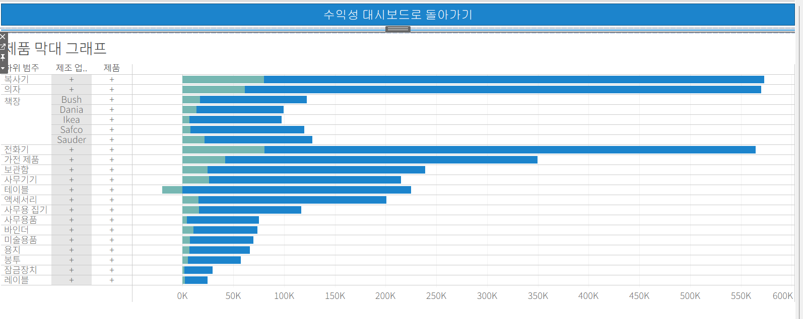

-> 제조 업체 클릭하면 제품 하위 범주 내에서 제조업체가 만드는 제품 보여줌 

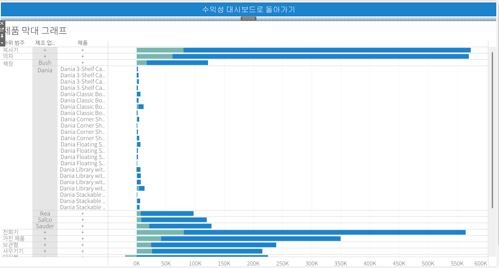

## 59강. 스토리패널

<!-- 스토리패널 강의에서 알게 된 점을 적어주세요 -->

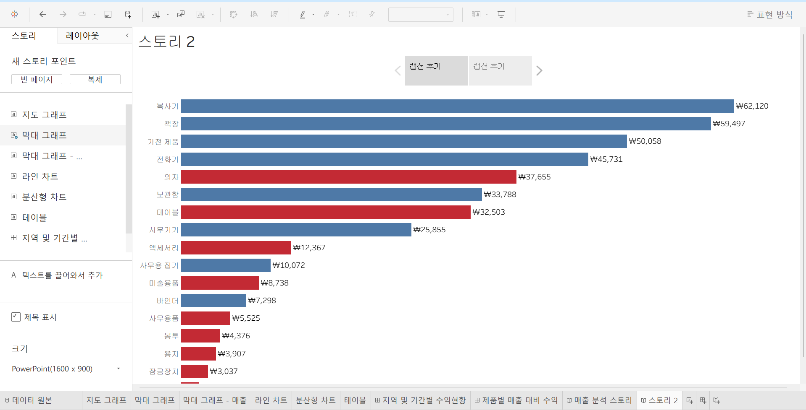

#### <왼쪽: 스토리 패널>

- 스토리 패널은 대시보드, 시트 및 텍스트 설명을 스토리 시트로 가져올 수 있음 

- 제목 표시 설정 / 크기 설정 가능 

- 워크시트 더블 클릭 or 드래그로 스토리 포인트에 이동 가능 

#### <오른쪽: 스토리 워크시트 페이지>

- 스토리 워크시트 페이지는 각 시트를 추가함으로써 스토리 포인트를 생성할 수 있는 공간 

- 스토리 포인트: 스토리 각각의 개별 시트 

- 스토리 툴 바 : 탐색기 영역을 마우스 오버할 때 나타나며 변경된 내용 되돌리기, 스토리 포인트에 대한 업데이트 적용, 삭제, 생성 가능 

- 탐색기 : 스토리 포인트 편집 및 구성 가능 , 스토리 단계 이동 가능, 탐색기 스타일은 레이아웃 패널에서 변경 가능 

## 60. 스토리

<!-- 알게 된 점을 적고, 아래 질문에 답해보세요 :) -->

### 스토리란?
생성한 워크시트와 대시보드에 설명을 덧붙여 데이터를 설명하거나 정보를 전달하고 의삭 결정에 도움을 주고 설득력 있는 사례를 구성하는 등의 기능을 구현하는 작업 

* 업데이트 시 스토리 포인트가 업데이트된 시점까지의 작업 상태를 나타내고
[새 이름으로 저장] 기능을 통해서 스토리 포인트 생성 시 생성된 시점의 작업 상태가 나타남 

* 스토리 기능을 이용해서 스토리 포인트 간의 플로우를 잘 구성하고 자신만의 스토리텔링을 완성하여 내용을 분석하고 적절한 인사이트를 얻을 수 있음 

 

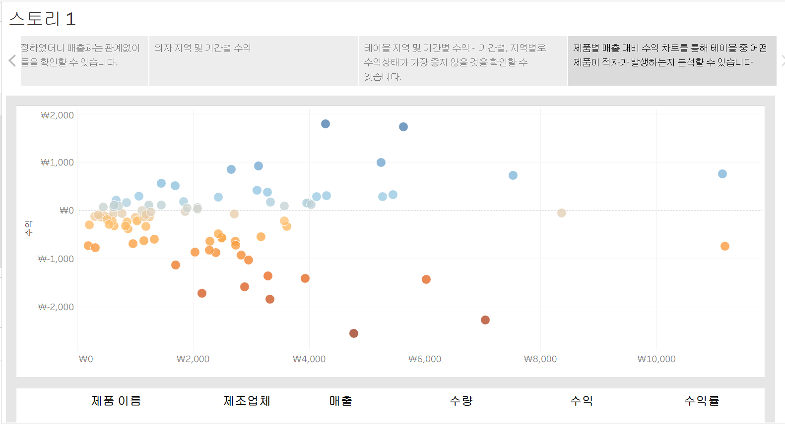

-> 전체적으로 살펴보면 매출은 문제가 없으나 수익에서 적자가 발생하는 항목을 찾아내고 그 항목 중에서 어떤 제품이 문제가 되는지 찾아내어 해결 방안을 생각할 수 있는 스토리 생성 

## 61. 대시보드 탐색

<!-- 대시보드 탐색 강의에서 알게 된 점을 적어주세요 -->

### <탐색 버튼 활성화 (eg. 맵 차트)>

맵 차트 대시보드 선택 -> 맵 차트 탐색 버튼 더블 클릭 -> 이동할 위치 [맵 차트 대시보드]로 선택한 후 [확인] -> 탐색 버튼 활성화됨 -> ALT 누른 채로 탐색 버튼 누르면 그림에 해당하는 대시보드로 이동함 

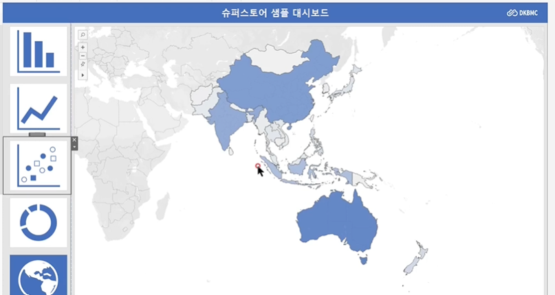

## 62. 태블로 단추
<!-- 태블로 단추 강의에서 알게 된 점을 적어주세요 -->

* 그래프 선택 -> 기타 옵션 클릭 -> [표시/숨기기 단추 추가]-> 부동 형태의 X자 단추 ALT 누른채 클릭하면 그래프 사라짐

* 부동 상태의 그래프 표시/숨기기 단추 우클릭 -> 부동 해제 -> 부동이 해제된 표시/숨기기 단추를 그래프 텍스트 오른쪽으로 옮기기 

* 표시/숨기기 단추 선택 -> 기타 옵션 [편집 단추] -> [표시하거나 숨길 대시보드 항목]: 표시/숨기기 기능을 적용시킬 항목 선택 -> [단추 스타일] : 이미지 / [표시된 항목] & [숨겨진 항목]에 스위치 ON & OFF 이미지 넣어서 지정한 항목이 표시되었을 때와 숨겨졌을 때의 단추 형태 지정 가능 

* 컨테이너 레벨에서 표시/숨기기 단추 이용하면 컨테이너 안에 있는 그래프들이 일괄적으로 표시 및 숨김 처리가 가능함 

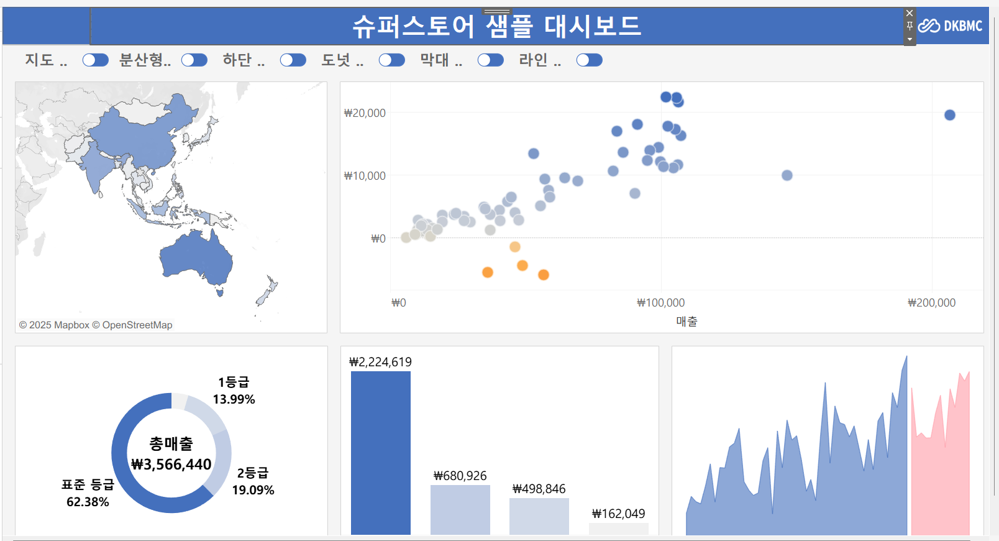

## 63. 막대그래프 드릴다운
<!-- 막대그래프 드릴다운에 대해 알게 된 점을 적어주세요 -->

### <드릴 다운이 [배송 형태] - [범주] - [하위 범주] 순서로 이루어지는 막대 그래프 생성>

1. 매출 필드 열 선반, 배송 형태 필드 행 선반으로 드래그
2. 매출 필드 마크 창의 색상, 레이블에 드래그 및 그래프 내림차순 정리

#### <[배송 형태]에서 [범주]로 드릴다운>

3. "데이터 Level1 " 매개변수 생성
데이터 유형 : 문자열 
4. 계산된 필드 생성 "드릴다운 1"
IF [배송 형태] = [매개 변수 Level 1]
THEN [범주]
ELSE [배송 형태]
END
5. 방금 전에 생성한 계산된 필드 실행하는데 필요한 동작 생성
[워크시트] -> [동작] -> [동작 추가] -> [매개 변수 변경]

 

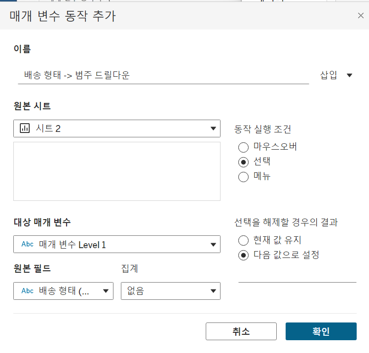

6. [드릴다운 1] 필드 행 선반 [배송 형태] 오른쪽으로 추가 
-> 막대 그래프의 막대 클릭하면 [배송 형태]에서 [범주]로 드릴다운됨 

  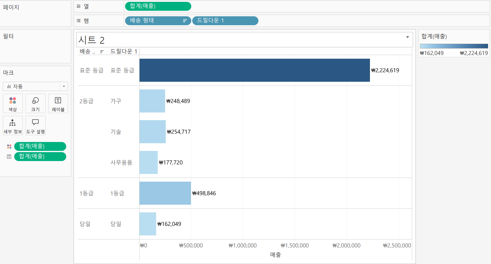

* 드릴다운 정렬 : 행 선반 필드 우클릭 -> 정렬 기준 [필드], 정렬 순서 [내림차순], 필드명 [매출]로 설정

#### <[범주]에서 [하위 범주]로 드릴다운>

7. "데이터 Level2 " 매개변수 생성
데이터 유형 : 문자열 
8. 계산된 필드 생성 "드릴다운 2" 
IF [드릴다운 1] = [매개 변수 Level 2]
THEN [하위 범주]
ELSE ''
END
9. [워크시트] -> [동작] -> [동작 추가] -> [매개 변수 변경]

10. 행 선반 [드릴다운 1] 오른쪽에 [드릴다운 2] 추가
-> 드릴다운 2번 시행됨 

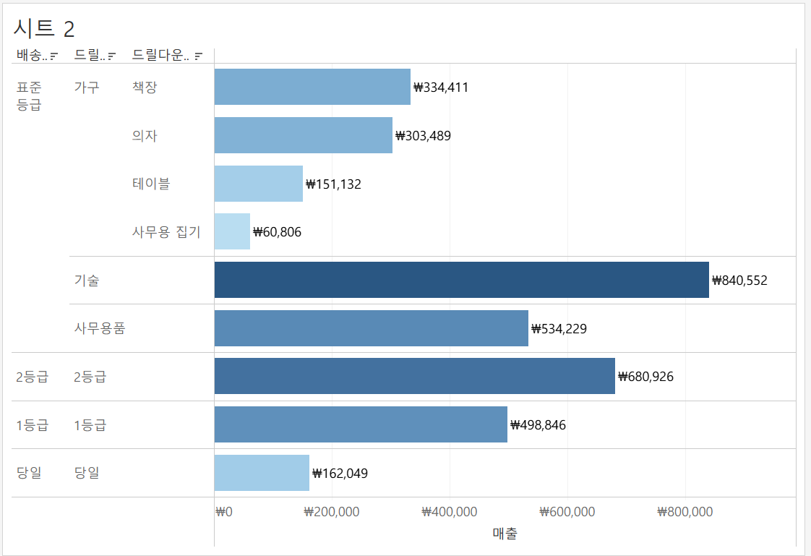

11. [드릴다운 1] 에 대한 레이블 필드 추가 

좌측 사이드 바에서 [드릴 다운 1] 필드 복제 -> ELSE 구문 뒤에 오는 필드를 [배송 형태]에서 "" 입력한 빈 필드로 변경 -> 필드명 [드릴다운 1 레이블]로 수정 -> 수정한 필드 행 선반 [드릴다운 1]과 [드릴다운 2]사이에 추가 -> 그래프에서 [드릴다운 1] 머리글 표시 해제 -> 그래프 상단 [필드 레이블] 우클릭 -> [행에 대한 필드 레이블 숨기기] 

----> 드릴다운을 실시할 때 막대 그래프의 행 레이블이 중복되지 않음

## 64. 트리맵 드릴다운
<!-- 트리맵 드릴다운에 대해 알게 된 점을 적어주세요 --> 

### <드릴 다운이 [Category] - [Sub-Category] - [Manufacturer] 순서로 이루어지는 트리맵 생성>

1. 매출, 범주 필드 매출 더블 클릭 
2. 표현 방식 -> 트리맵

#### <[Category] - [Sub-Category]로 드릴다운>

3. 집합 생성 
좌측 사이드 바에서 [Category] 필드 우클릭 -> 만들기 -> 집합 -> Categoty 집합 이름 그대로 두고 확인 
4. 계산된 필드 [드릴다운 1] : [Categoty 집합]일 경우 [Sub-Category]로 드릴다운되고 그렇지 않을 경우 [Category]가 되는 함수 생성
IF [Category 집합] THEN [Sub-Category]
ELSE [Category]
END
5.  [워크시트] -> [동작] -> [동작 추가] -> [집합 값 변경] 

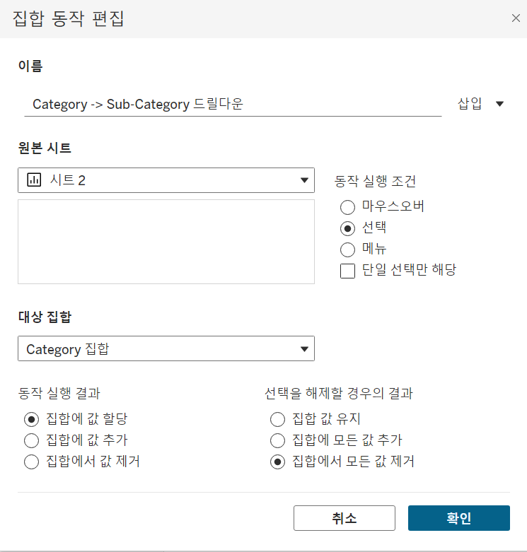

6. [드릴다운 1] 필드 마크 선반의 [레이블] 마크에 드래그하고 가장 아래쪽에 위치시키기 
-> 트리맵이 [Category]에서 [Sub-Category]로 드릴다운 됨 

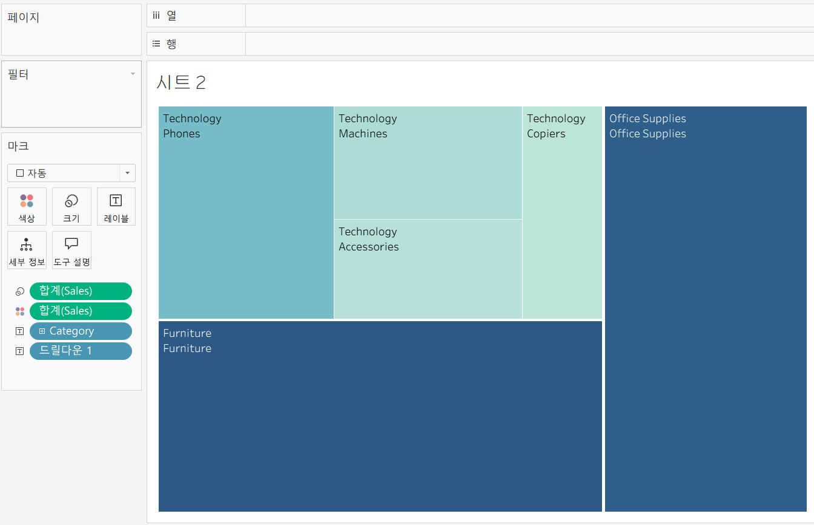

#### <[Sub-Category] - [Manufacturer]로 드릴다운>
7. 좌측 사이드 바에서 [드릴다운 1] 필드 우클릭 -> 만들기 -> 집합 -> 드릴다운 1 집합 이름 그대로 두고 확인
8. 계산된 필드 [드릴다운 2] : [드릴다운 1 집합]일 경우 [Manufacturer]로 드릴다운 되고 그렇지 않을 경우 아무것도 출력하지 않는 필드 생성
IF [드릴다운 1 집합] THEN [Manufacturer]
ELSE ""
END
9. [워크시트] -> [동작] -> [동작 추가] -> [집합 값 변경] 

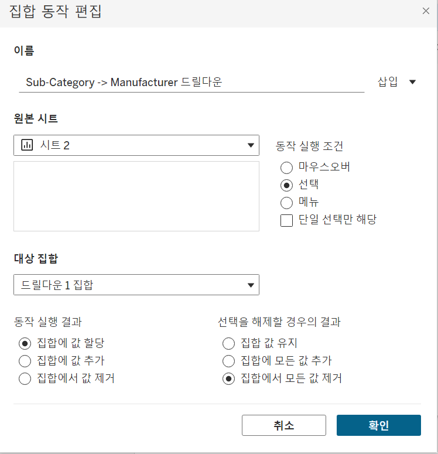

10. [드릴다운 2] 필드 마크 선반은 [레이블] 마크에 드래그하고 가장 아래쪽에 위치 시키기 
-> 드릴다운 2번 시행됨

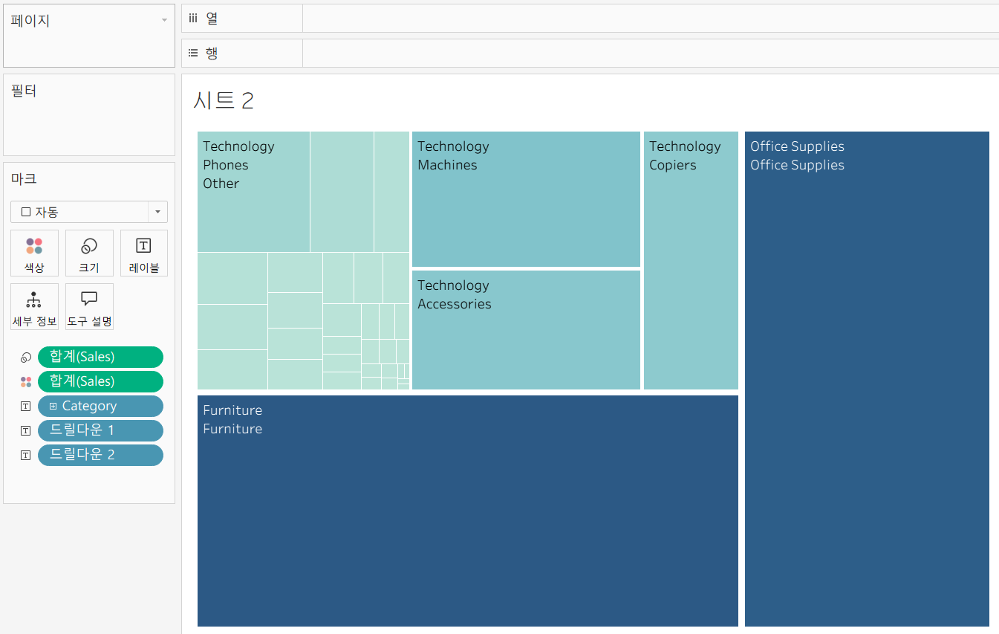

11. [드릴다운 1] 에 대한 레이블 필드 추가 
좌측 사이드 바에서 [드릴 다운 1] 필드 복제 -> ELSE 구문 뒤에 오는 필드를 [Category]에서 "" 입력한 빈 필드로 변경 -> 필드명 [드릴다운 1 레이블]로 수정 -> [드릴다운 1 레이블] 필드 마크 선반의 [레이블] 마크에 추가 -> [드릴다운 1] 필드 드래그해 [색상] 마크 [Sales] 필드 덮기 -> 마크 선반 순서 [Category] - [드릴다운 1 레이블] - [드릴다운 2] - [드릴다운 1] 순으로 배치 

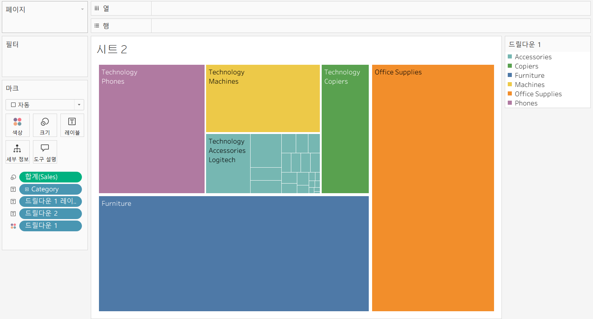

-> 드릴다운 실행 시 트리맵 레이블이 중복되지 않으며 각 구역을 유지하면서 드릴다운 됨 

## 65. 파이 차트 드릴다운

<!-- 파일 차트 드릴다운에 대해 알게 된 점을 적어주세요 -->

## 66. 지도 드릴다운

<!-- 지도 드릴다운에 대해 알게 된 점을 적어주세요 -->
