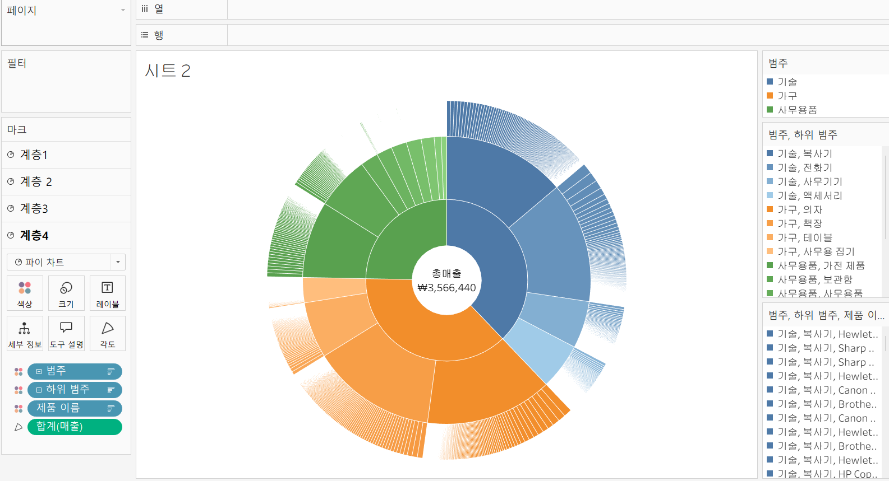
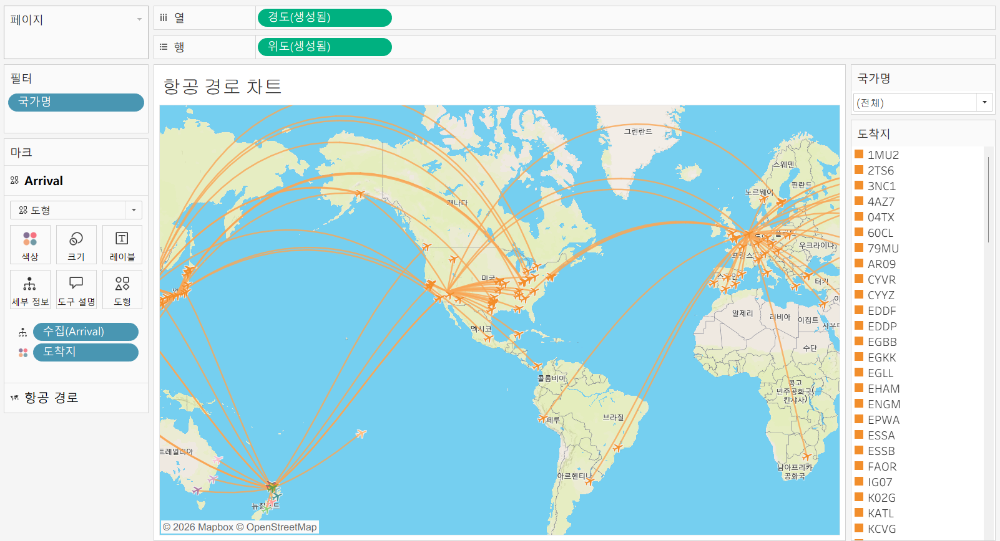
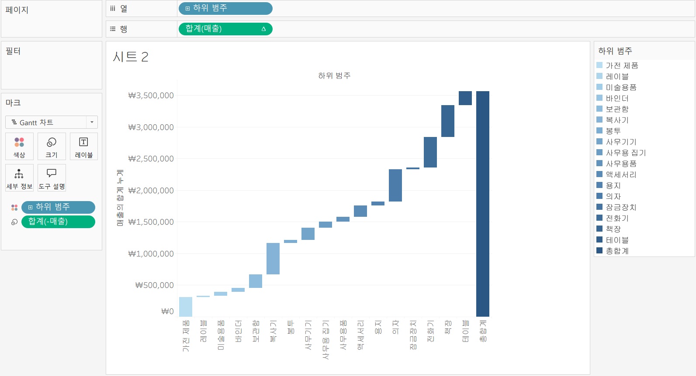
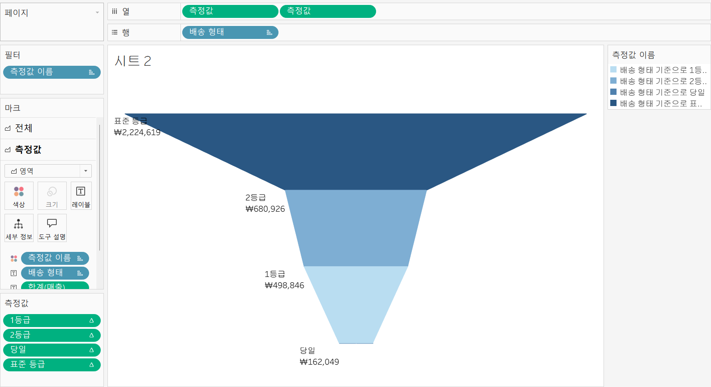

# 8th Study Week

## Study Schedule

 

| 회차 | 강의 범위   | 강의 이수 여부 | 링크                                                                                                     |
|------|-------------|----------------|--------------------------------------------------------------------------------------------------------|
| 1    | 1~7강       | ✅              | [링크](https://www.youtube.com/watch?v=AXkaUrJs-Ko&list=PL87tgIIryGsa5vdz6MsaOEF8PK-YqK3fz&index=84)    |
| 2    | 8~17강      | ✅              | [링크](https://www.youtube.com/watch?v=AXkaUrJs-Ko&list=PL87tgIIryGsa5vdz6MsaOEF8PK-YqK3fz&index=75)    |
| 3    | 18~27강     | ✅              | [링크](https://www.youtube.com/watch?v=AXkaUrJs-Ko&list=PL87tgIIryGsa5vdz6MsaOEF8PK-YqK3fz&index=65)    |
| 4    | 28~37강     | ✅              | [링크](https://www.youtube.com/watch?v=e6J0Ljd6h44&list=PL87tgIIryGsa5vdz6MsaOEF8PK-YqK3fz&index=55)    |
| 5    | 38~47강     | ✅              | [링크](https://www.youtube.com/watch?v=AXkaUrJs-Ko&list=PL87tgIIryGsa5vdz6MsaOEF8PK-YqK3fz&index=45)    |
| 6    | 48~57강     | ✅              | [링크](https://www.youtube.com/watch?v=AXkaUrJs-Ko&list=PL87tgIIryGsa5vdz6MsaOEF8PK-YqK3fz&index=35)    |
| 7    | 58~66강     | ✅             | [링크](https://www.youtube.com/watch?v=AXkaUrJs-Ko&list=PL87tgIIryGsa5vdz6MsaOEF8PK-YqK3fz&index=25)    |
| 8    | 67~77강     | ✅             | [링크](https://www.youtube.com/watch?v=AXkaUrJs-Ko&list=PL87tgIIryGsa5vdz6MsaOEF8PK-YqK3fz&index=15)    |
| 9    | 78~85강     | 🍽️             | [링크](https://www.youtube.com/watch?v=AXkaUrJs-Ko&list=PL87tgIIryGsa5vdz6MsaOEF8PK-YqK3fz&index=5)     |
---

## 67. 선버스트 차트

선버스트 차트란?
중심으로부터 점점 세분화되며 각각의 계층별로 분류된 항목과 값을 보여주는 차트

**<선버스트 차트 실습>**

1. 계산된 필드 [중심] 필드 생성  
MAKEPOINT(0,0) 
2. [중심] 필드 더블 클릭 후 드래그하여 [계층 추가]  -> 반복하여 총 4개의 계층 만들기 
3. 상단의 [위도], [경도] 필드 제거
4. **모든 계층 편집 시 크기 조정 필요**  

[계층 1]  
마크 유형 [파이 차트]로 선택 / [색상] 흰색으로 변경

[계층 2]  
마크 유형 [파이 차트]로 선택 / [세부 정보]의 [중심] 
필드 제거 / [범주] 필드 [색상] 마크에 추가 / [매출] 필드 [각도] 마크에 추가 

[계층 3]  
마크 유형 [파이 차트]로 선택 / [세부 정보]의 [중심] 필드 제거 / [범주] 필드 [색상] 마크에 추가 / [매출] 필드 [각도] 마크에 추가 / [범주] 필드 + 버튼 클릭해 [하위 범주] 추가/ [하위 범주] 필드 마크 유형 [색상]으로 변경 

[계층4]  
마크 유형 [파이 차트]로 선택 / [세부 정보]의 [중심] 필드 제거 / [범주] 필드 [색상] 마크에 추가 / [매출] 필드 [각도] 마크에 추가 / [범주] 필드 + 버튼 두 번 클릭해 [제품 이름]까지 추가/ [하위 범주],[제품 이름] 필드 마크 유형 [색상]으로 변경

5. 계층 4 선택된 채로 마크 선반 [범주] 필드 우클릭 해 [정렬] 선택  
[정렬 기준] : 필드 , [정렬 순서] : 내림차순 , [필드명]: 매출  
-> [하위 범주]와 [제품 이름] 도 같은 방법으로 정렬 실시

6. 모든 계층 [색상] 마크 테두리 흰색으로 지정 

## 68. 항공 경로 차트

1. 계산된 필드 만들기

- [Departure]  
MAKEPOINT([Latitude (Departure)], [Longitude (Departure)])

- [Arrival]  
MAKEPOINT([Latitude (Arrival)], [Longitude (Arrival)])

- [항공 경로]  
MAKELINE([Departure], [Arrival])

2. [항공 경로] 필드 더블 클릭 
3. [출발지], [도착지] 필드 [세부 정보] 마크에 추가
4. [도구 설명] 마크 클릭해 [출발지] 레이블을 [도착지] 위쪽에 위치하도록 배치
5. 항공 경로 도착 지점에 비행기 이미지 삽입
- [Arrival] 필드 뷰 화면으로 드래그 해 계층 추가
- [문서] - [내 Tableau 리포지토리] - [모양] 으로 비행기 이미지 복사 
- 마크 카드 유형 [자동] -> [모양]으로 변경
- [도착지] 필드 [색상] 마크에 추가 
- [모양] -> [추가 모양] -> [사용자 지정] -> 비행기 이미지 선택
6. 우측의 도착지 범례 선택해 색상 통일 
7. [항공 경로] 계층 선택해 [색상] 마크에서 색상 변경 
8. [맵] - [백그라운드 레이어] - [백그라운드] - [스타일] - [아웃도어]
9. [국가명] 필드 [필터 선반]에 추가 -> [필터] 창에서 [전체] 체크 후 [확인] -> 우클릭 후 [필터 표시] 체크  
-> 국가명 변경할 때마다 해당 국가의 항공 경로 나타남
 

## 69. 워터폴 차트

1. [하위 범주] 필드 열 선반, [매출] 필드 행 선반에 드래그
2. [매출] 필드 우클릭 - [퀵 테이블 계산] - [누계]
3. - [매출] 계산된 필드 만들기
4. 마크 유형 [자동] -> [Gantt 차트]
5. [-매출] 필드 [크기] 마크, [하위 범주]는 [색상] 마크로 드래그 
6. 좌측 상단 [분석] 패널에서 [요약]의 [총계] 드래그하여 [행 총합계]에 추가
7. 그래프 우클릭 -> [서식] -> 테두리 -> [총합계] - [패널], [머리글] - [없음]
8. [하위 범주 범례] 더블 클릭 -> 원하는 색상 선택  -> 모양 할당 -> 확인

-> 각각의 차원별 측정값이 누계 형식으로 표현되고 마지막 열에 행에 대한 총합계가 표현되는 '워터폴 차트' 생성  

## 70. 퍼널 차트

1. [배송 형태] 필드 행 선반에 드래그 
2. 계산된 필드 작성 [1등급] : [배송 형태]의 데이터가 '1등급'이거나 [배송 형태]의 이전 값을 조회하였을 때, '1등급'일 경우에 [메츨]의 합계 출력 
IF ATTR([배송 형태]) = '1등급'
OR LOOKUP(ATTR([배송 형태]), -1) = '1등급'
THEN SUM([매출])
END
3. 생성한 [1등급] 필드 3번 복제
4. 복제한 필드의 계산식에서 '1등급' -> '2등급' , '표준 등급', '당일'로 내용 및 제목 변경
5. [측정값 이름] 필드 필터 선반에 드래그 -> [없음] -> [1등급] , [2등급] , [표준 등급], [당일] 필드만 체크
6. [측정값] 필드 열 선반, [측정값 이름] 필드 색상 마크에 추가하고 내림차순 정렬
7. 열 선반 [측정값] 필드 ctrl 눌러 복사 -> 좌측 그래프 하단 축 우클릭 -> [축 편집] -> [눈금] - [반전]
8. 마크 선반에서 [전체] 축 선택하여 마크 유형 [자동] -> [영역]
9. [분석] - [마크 누적] - [해제]
10. 좌측 [측정값] 선반에서 [1등급] 필드 우클릭 - [다음을 사용하여 계산] - [배송 형태]
-> 나머지 3개의 필드도 같은 작업 실시 
11. [배송 형태], [매출] 마크 선반 [레이블] 마크에 추가 

## 71. 그라데이션 막대그래프

그라데이션 막대그래프의 표현
- 두 점을 찍고 그래프를 경로로 표현하는 것
- 라인 차트 형태의 그래프를 이용하여 막대그래프를 생성하는 것 

1. 계산된 필드 [시작점]
SUM(0)
2. [주문 날짜] 필드 열 선반, [측정값] 필드 행 선반에 드래그 
3. [측정값 선반]에서 [매출], [시작점] 필드 제외하고 전부 제거
4. 화면 전체보기, 내림차순 정렬 
5. 마크 유형 [자동] -> [라인]
6. [세부정보] 마크의 [측정값 이름] 필드 복사해 [색상] 마크에 추가하고 남은 한 개의 필드는 [경로] 마크에 추가
7. [크기] 최대로 설정하고 우측 상단의 [측정값 이름] 범례 더블 클릭해 색상 변경
8. 그래프 세로축 우클릭 -> [축 편집] -> [범위] - [고정] - [고정된 시작] 값 : 0

## 72. 온도계 차트

## 73. 원형 막대그래프

## 74. 게이지 차트

## 75. 스노우플레이크를 통한 데이터 연결

## 76. 날짜별 측정 값 

## 77. 전년 대비

9주차는 나중에.. 일단 5일은 여기까지만 듣고 연습문제 풀기!! 